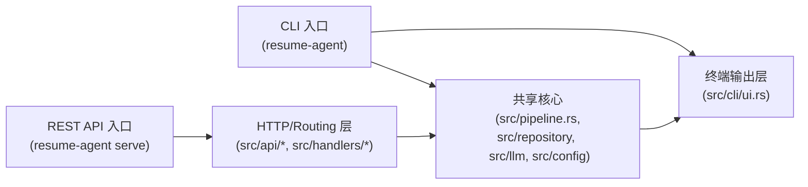

# CLI 与 REST API 集成架构

## 目标

本架构说明当前项目中 CLI 和 API 两种运行方式如何共用同一套核心业务逻辑，避免重复实现。重点说明入口层、共享层、以及两者之间的复用关系。

## 总体架构

- `CLI`：本地命令行程序入口，面向开发者/运维用户。
- `API`：嵌入式 HTTP 服务入口，面向前端或远程调用方。
- `核心`：文件解析、LLM 评估、结果存储、任务管理等业务逻辑。

## 入口层

### 1. `main.rs`

`repo/backend/src/main.rs` 是程序启动入口。

- 解析命令行参数
- 如果子命令是 `Serve`，启动 HTTP 服务
- 否则进入 CLI 子命令执行

这意味着：

- `resume-agent <command>`：走 CLI 入口
- `resume-agent serve --port 8080`：走 API 入口

## CLI 层

### 2. CLI 命令解析

`repo/backend/src/cli/mod.rs` 定义了所有命令和参数：

- `run-dir` / `run-files` / `run-fresh-dir` / `run-fresh-files`
- `rerun` / `rerun-fresh`
- `job-list` / `jd-list` / `jd-show`
- `db-status` / `db-reset`
- `model` 子命令组
- `serve`

### 3. CLI 执行流程

CLI 模式下，关键函数是 `run_pipeline(...)`：

- 解析命令参数
- 收集文件路径
- 解析模型选择逻辑
- 调用 `pipeline::run(...)`

因此 CLI 只是“入口+参数解析+输出”，业务执行通过 `src/pipeline.rs` 完成。

## API 层

### 4. API 路由与服务

`repo/backend/src/api/mod.rs` 负责 Actix-Web 的 HTTP 路由注册：

- `/api/v1/auth/*`
- `/api/v1/jobs*`
- `/api/v1/jds*`
- `/api/v1/models*`
- `/api/v1/users*`
- `/api/v1/system*`

其中，`/api/v1/jobs` 相关操作会执行评估任务。

### 5. API 业务处理

`repo/backend/src/handlers/job.rs` 等 handler 负责将 HTTP 请求转换为业务调用。

- `POST /api/v1/jobs`：上传文件后创建任务
- `POST /api/v1/jobs/{id}/rerun`：重新触发任务
- `GET /api/v1/jobs/{id}/status`：查询任务状态
- `GET /api/v1/jobs/{id}/sse`：订阅 SSE 实时事件

### 6. API 与 SSE

API 侧针对 `POST /api/v1/jobs` 会：

- 保存上传文件
- 创建广播通道
- 后台 `tokio::spawn` 调用 `pipeline::run_with_sse(...)`
- 通过 SSE 发送实时进度

这使得 API 模式可以在不阻塞 HTTP 请求的情况下执行长任务。

## 共享核心

### 7. Pipeline 与复用

两个入口都复用核心模块：

- `repo/backend/src/pipeline.rs`
- `repo/backend/src/repository/*`
- `repo/backend/src/llm/*`
- `repo/backend/src/config/*`
- `repo/backend/src/utils/*`

其中：

- CLI 调用 `pipeline::run(...)`
- API 调用 `pipeline::run_with_sse(...)`

这两个函数在同一套业务逻辑基础上，分别适配终端输出和 SSE 推送。

### 8. 模型选择与配置

CLI 和 API 都共用模型解析逻辑：

- 通过 `application.local.yaml` 的 `llm.default_model`
- 通过数据库 `model_infos` 表
- 通过 CLI 或 API 请求参数覆盖

这保证了两种入口看到的模型配置是一致的。

## 关键复用点

| 层级      | CLI                  | API                                 | 共享核心                       |
| --------- | -------------------- | ----------------------------------- | ------------------------------ |
| 启动入口  | `src/main.rs`        | `src/main.rs`                       | 同一二进制程序                 |
| 命令/路由 | `src/cli/mod.rs`     | `src/api/mod.rs` + `src/handlers/*` | 共享模块                       |
| 任务执行  | `pipeline::run(...)` | `pipeline::run_with_sse(...)`       | `src/pipeline.rs`              |
| 用户交互  | 终端打印             | JSON/HTTP/SSE                       | `ApiResponse` + `AppError`     |
| 模型管理  | `src/cli/model.rs`   | `handlers::model.rs`                | `src/repository/model_info.rs` |

## 设计原则

- “入口层”与“业务层”分离
- CLI 负责本地交互与参数解析
- API 负责 HTTP 协议与身份认证
- 核心业务逻辑只写一份，避免双倍维护成本
- API 通过 SSE / 后台任务补齐长任务响应场景

## 结论

当前架构不是两套完全独立的逻辑，而是：

- 共享同一套核心业务代码
- CLI 和 API 各自负责不同的入口适配层
- `main.rs` 根据命令选择运行模式
- API 额外提供 HTTP/认证/SSE 层，但真正的“简历评估流水线”由同一个 `pipeline` 模块驱动
