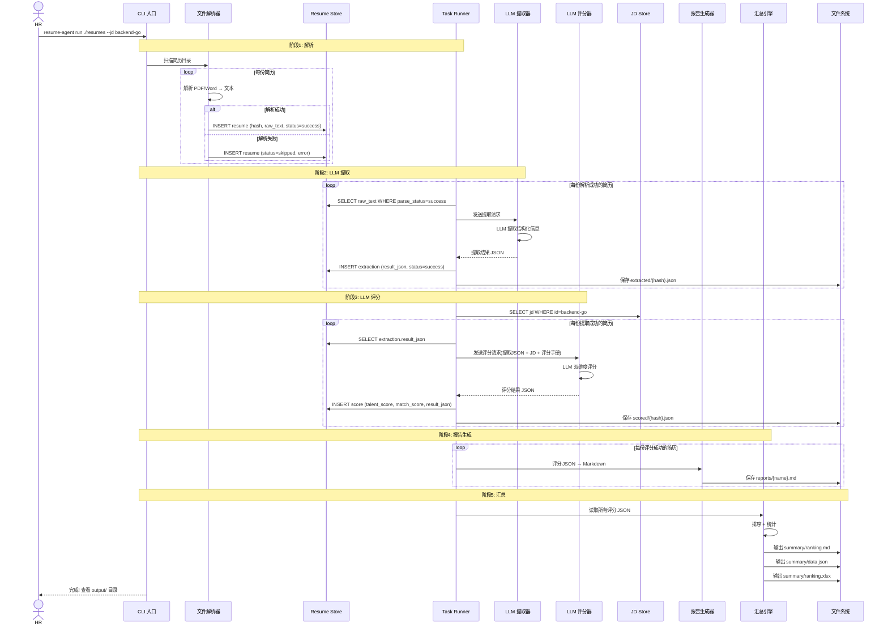
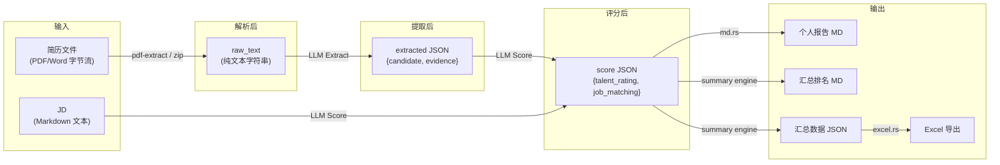
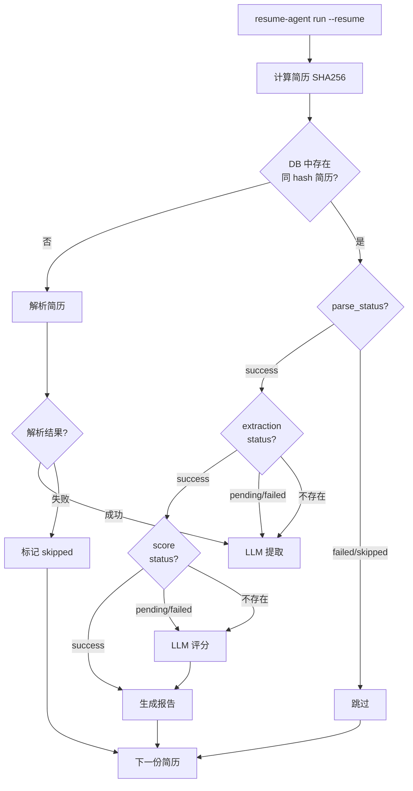
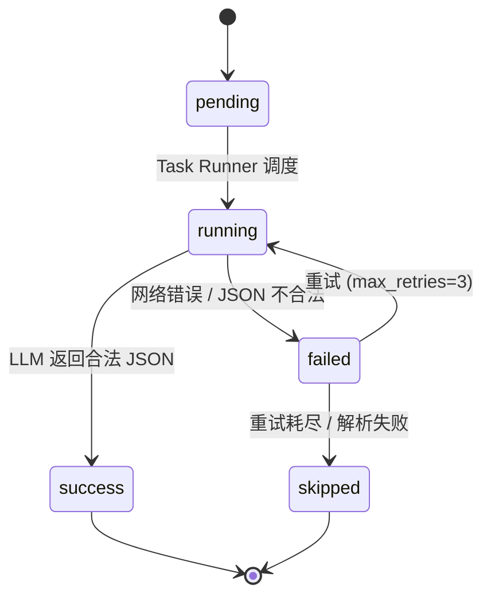

# 数据流设计

## 完整处理流程

```mermaid
sequenceDiagram
  actor HR
  participant CLI as CLI 入口
  participant Parser as 文件解析器
  participant RS as Resume Store
  participant TR as Task Runner
  participant Extractor as LLM 提取器
  participant Scorer as LLM 评分器
  participant JDS as JD Store
  participant Report as 报告生成器
  participant Summary as 汇总引擎
  participant FS as 文件系统

  HR->>CLI: resume-agent run ./resumes --jd backend-go

  Note over CLI,TR: 阶段1: 解析

  CLI->>Parser: 扫描简历目录
  loop 每份简历
    Parser->>Parser: 解析 PDF/Word → 文本
    alt 解析成功
      Parser->>RS: INSERT resume (hash, raw_text, status=success)
    else 解析失败
      Parser->>RS: INSERT resume (status=skipped, error)
    end
  end

  Note over CLI,Extractor: 阶段2: LLM 提取

  loop 每份解析成功的简历
    TR->>RS: SELECT raw_text WHERE parse_status=success
    TR->>Extractor: 发送提取请求
    Extractor->>Extractor: LLM 提取结构化信息
    Extractor-->>TR: 提取结果 JSON
    TR->>RS: INSERT extraction (result_json, status=success)
    TR->>FS: 保存 extracted/{hash}.json
  end

  Note over CLI,Scorer: 阶段3: LLM 评分

  TR->>JDS: SELECT jd WHERE id=backend-go
  loop 每份提取成功的简历
    TR->>RS: SELECT extraction.result_json
    TR->>Scorer: 发送评分请求(提取JSON + JD + 评分手册)
    Scorer->>Scorer: LLM 双维度评分
    Scorer-->>TR: 评分结果 JSON
    TR->>RS: INSERT score (talent_score, match_score, result_json)
    TR->>FS: 保存 scored/{hash}.json
  end

  Note over CLI,Summary: 阶段4: 报告生成

  loop 每份评分成功的简历
    TR->>Report: 评分 JSON → Markdown
    Report->>FS: 保存 reports/{name}.md
  end

  Note over CLI,FS: 阶段5: 汇总

  TR->>Summary: 读取所有评分 JSON
  Summary->>Summary: 排序 + 统计
  Summary->>FS: 输出 summary/ranking.md
  Summary->>FS: 输出 summary/data.json
  Summary->>FS: 输出 summary/ranking.xlsx

  CLI-->>HR: 完成! 查看 output/ 目录
```

## 关键数据结构流转

```mermaid
flowchart LR
  subgraph Input["输入"]
    A["简历文件<br/>(PDF/Word 字节流)"]
    B["JD<br/>(Markdown 文本)"]
  end

  subgraph Stage1["解析后"]
    C["raw_text<br/>(纯文本字符串)"]
  end

  subgraph Stage2["提取后"]
    D["extracted JSON<br/>{candidate, evidence}"]
  end

  subgraph Stage3["评分后"]
    E["score JSON<br/>{talent_rating, job_matching}"]
  end

  subgraph Output["输出"]
    F["个人报告 MD"]
    G["汇总排名 MD"]
    H["汇总数据 JSON"]
    I["Excel 导出"]
  end

  A -->|"pdf-extract / zip"| C
  C -->|"LLM Extract"| D
  D -->|"LLM Score"| E
  B -->|"LLM Score"| E
  E -->|"md.rs"| F
  E -->|"summary engine"| G
  E -->|"summary engine"| H
  H -->|"excel.rs"| I
```

## 断点续跑流程

```mermaid
flowchart TB
  Start["resume-agent run --resume"] --> CheckHash["计算简历 SHA256"]
  CheckHash --> ExistCheck{"DB 中存在<br/>同 hash 简历?"}

  ExistCheck -->|"否"| Parse["解析简历"]
  ExistCheck -->|"是"| StatusCheck{"parse_status?"}

  StatusCheck -->|"success"| ExtractCheck{"extraction<br/>status?"}
  StatusCheck -->|"failed/skipped"| Skip1["跳过"]

  Parse --> ParseResult{"解析结果?"}
  ParseResult -->|"成功"| Extract["LLM 提取"]
  ParseResult -->|"失败"| MarkSkipped["标记 skipped"]

  ExtractCheck -->|"success"| ScoreCheck{"score<br/>status?"}
  ExtractCheck -->|"pending/failed"| Extract
  ExtractCheck -->|"不存在"| Extract

  ScoreCheck -->|"success"| ReportGen["生成报告"]
  ScoreCheck -->|"pending/failed"| Score["LLM 评分"]
  ScoreCheck -->|"不存在"| Score

  Score --> ReportGen

  MarkSkipped --> NextResume["下一份简历"]
  Skip1 --> NextResume
  ReportGen --> NextResume
```

## 状态机

```mermaid
stateDiagram-v2
  [*] --> pending
  pending --> running: Task Runner 调度
  running --> success: LLM 返回合法 JSON
  running --> failed: 网络错误 / JSON 不合法
  failed --> running: 重试 (max_retries=3)
  failed --> skipped: 重试耗尽 / 解析失败
  success --> [*]
  skipped --> [*]
```
