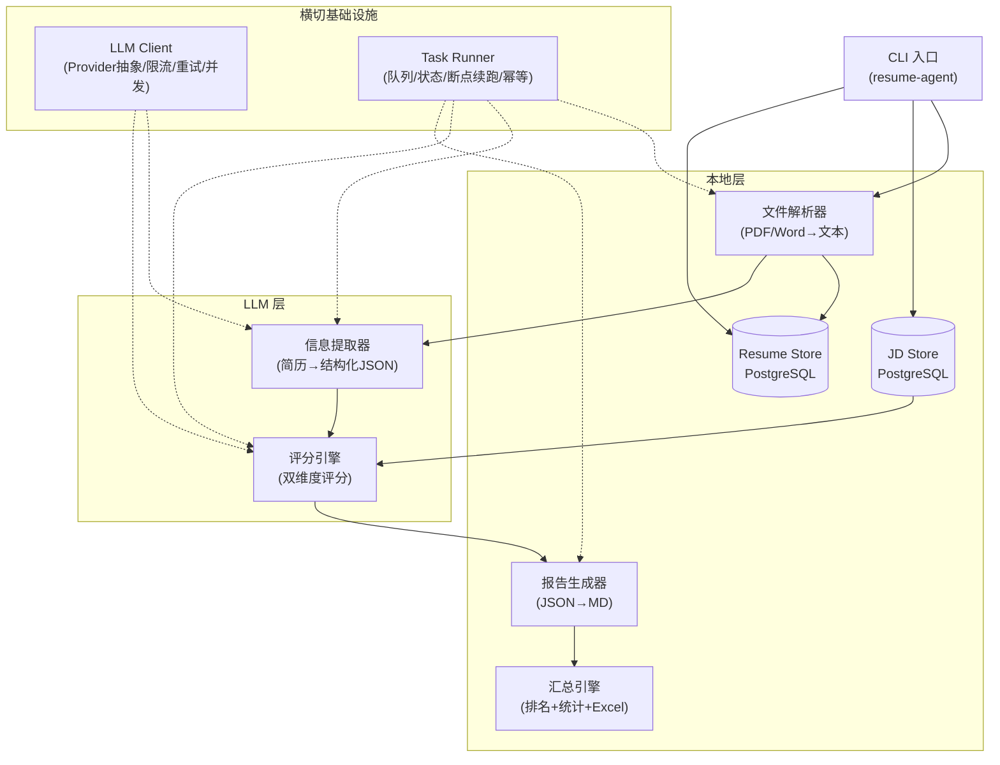
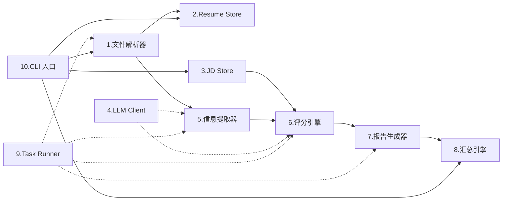
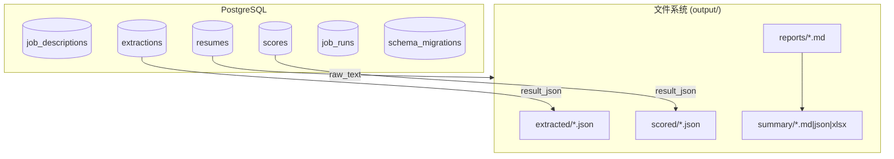

# 架构总览

> 关联设计文档: `docs/superpowers/specs/2026-05-28-resume-agent-design.md`

## 架构模式

**混合架构** —— 确定性步骤本地执行，需要判断推理的步骤 LLM 执行。

## 设计原则

| 原则                   | 说明                                                                     |
| ---------------------- | ------------------------------------------------------------------------ |
| **LLM 只做判断**       | 文件解析、格式转换、汇总排序由本地代码完成。LLM 仅负责"看懂简历"和"打分" |
| **提取一次，评分多次** | 简历提取结果与 JD 无关，同一份提取结果可对多个 JD 评分                   |
| **每一步幂等**         | 基于 SHA256 做去重，中断后可断点续跑                                     |
| **中间产物全程留存**   | extracted JSON、score JSON 全部持久化，方便调试和复用                    |
| **Prompt 与代码分离**  | Prompt 模板独立为 Markdown 文件，用占位符注入变量                        |

## 模块关系

## 数据存储策略

**双重存储**：评分结果同时写入 PostgreSQL（JSONB，方便查询排序）和文件系统（Markdown/JSON，方便人工阅读）。

## 技术选型理由

| 决策         | 选择                   | 原因                                                      |
| ------------ | ---------------------- | --------------------------------------------------------- |
| 数据库       | PostgreSQL             | 全栈项目长期选择，JSONB 支持灵活查询，后续 Web 版无需迁移 |
| 语言         | Rust                   | 高性能、内存安全，SeaORM 生态完善                            |
| 迁移方案     | 版本号 SQL             | 简单可追溯，适合 MVP 快速迭代                             |
| LLM 两次调用 | 提取+评分分开          | 好调试，提取结果可复用，prompt 更聚焦                     |
| Prompt 管理  | Markdown 文件 + 占位符 | 与代码解耦，方便 diff/Review/A/B 测试                     |
