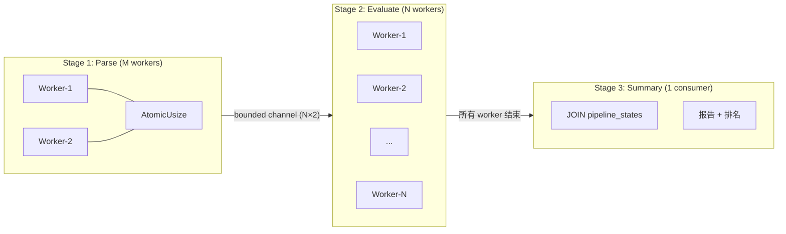
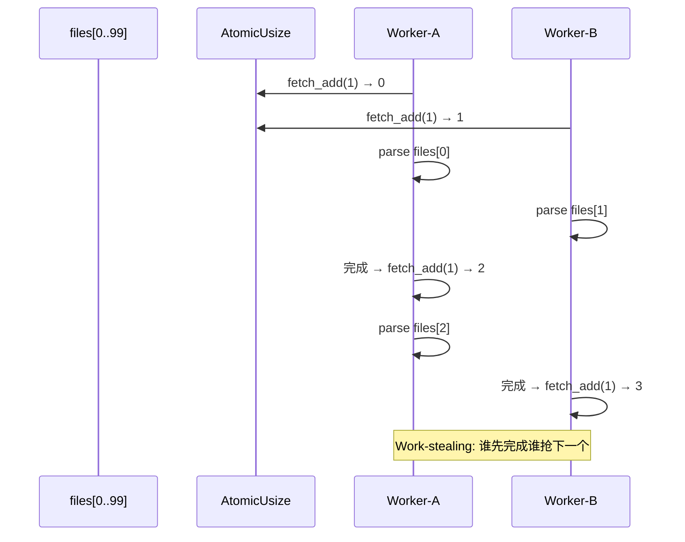
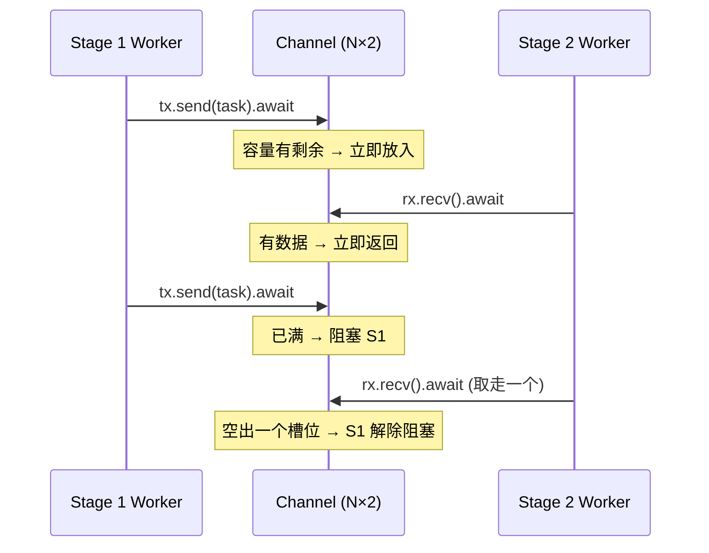
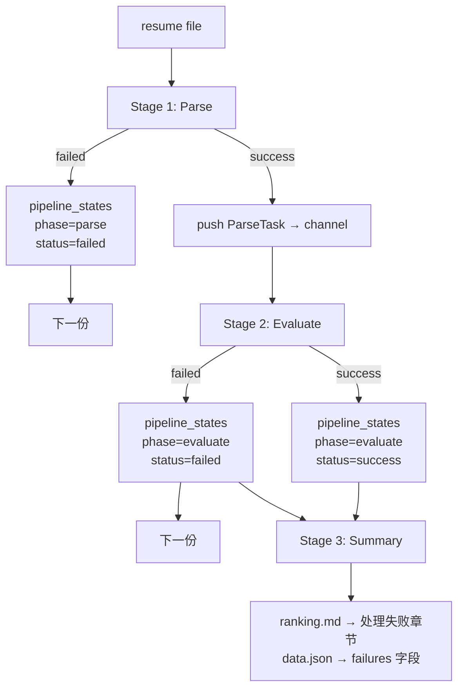
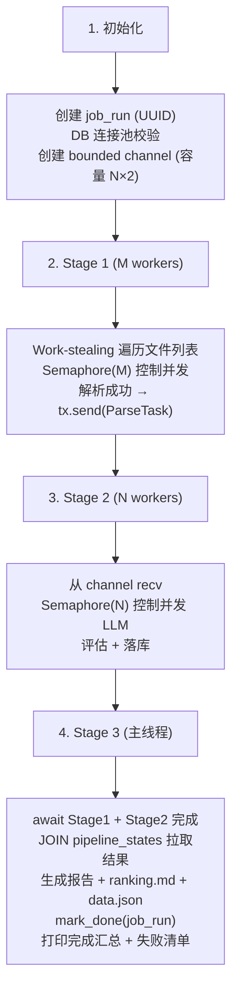

# Pipeline 并发模型

> 关联: `docs/superpowers/specs/2026-05-31-v0.3-concurrency-design.md` | 模块规格: `docs/architecture/modules.md`

## 一、模型概述

Producer-Consumer 管道，3 个 Stage，Stage 间通过 `tokio::sync::mpsc` bounded channel 连接。调度采用 Work-stealing 模式——各 worker 通过共享原子索引竞争获取下一个任务，快的多干、慢的少干，天然负载均衡。



## 二、任务分配: Work-stealing

Stage 1 和 Stage 2 统一使用 `Arc<AtomicUsize>` + `Semaphore` 模式分配任务，不预先分组。



```rust
// 伪代码：Stage 1 Work-stealing 模式
let idx = Arc::new(AtomicUsize::new(0));
let sem = Arc::new(Semaphore::new(M));

for file_path in &files {
    let permit = sem.clone().acquire_owned().await;
    let tx = tx.clone();
    let fp = file_path.clone();
    tokio::spawn(async move {
        let _permit = permit;
        let task = parse_one(&fp).await;
        let _ = tx.send(task).await;
    });
}
```

Stage 2 同理——每从 channel 收到一个 ParseTask 就 `acquire` → `spawn` → worker 内 `release`。

## 三、Stage 设计

### Stage 1: Parse Workers

| 属性 | 值 |
|------|-----|
| 角色 | Producer |
| Worker 数 | M，来自 `pipeline.parse_workers`，默认 2 |
| 分配策略 | Work-stealing (`Arc<AtomicUsize>`) |
| 并发控制 | `Semaphore(M)`，最多 M 个 task 同时在跑 |
| 工作内容 | 读文件 → SHA256 去重 → 解析 PDF/Word → 更新 resumes 表 → 登记 pipeline_states |
| 产出 | `ParseTask { resume_id, raw_text }`，推入 channel |
| 失败处理 | parse 失败 → 记录 pipeline_states(status=failed) → 继续下一份 |

**M 为何默认 2**：解析是本地 IO 密集型，2 个并发已可饱和磁盘读取。

### Stage 2: Evaluate Workers

| 属性 | 值 |
|------|-----|
| 角色 | Consumer + Producer（产出入库） |
| Worker 数 | N，来自 `llm.concurrency`，默认 3 |
| 分配策略 | Work-stealing（channel recv → sem acquire → spawn） |
| 并发控制 | `Semaphore(N)`，最多 N 个 LLM 同时在飞 |
| 工作内容 | 从 channel recv → 检查已有 evaluation（幂等）→ 调 LLM → 落库 evaluations + pipeline_states |
| 产出 | 存入 evaluations 表 + pipeline_states，Stage 3 通过 DB 读取 |
| 失败处理 | LLM 失败 → 记录 pipeline_states(status=failed) → 继续下一份 |

**N 为何默认 3**：大多数 LLM API 免费 tier 的保守并发数。

### Stage 3: Summary

| 属性 | 值 |
|------|-----|
| 角色 | Consumer（DB 汇聚） |
| Worker 数 | 1 |
| 工作内容 | 等待 Stage 1 + Stage 2 全结束 → `list_success_by_job_run()` 从 DB JOIN pipeline_states 拉取本 run 成功结果 → 生成个人报告 → 生成 ranking.md + data.json（含失败清单）→ 更新 job_runs |

## 四、Channel 与背压

```
channel 容量 = N × 2
```



- 当 Stage 2 全部 busy 时，channel 最多缓存 N×2 个 ParseTask
- channel 满时 `tx.send()` 阻塞 → Stage 1 自动降速
- 防止内存中堆积过多未处理任务

## 五、配置

```yaml
# application.yaml
pipeline:
  parse_workers: 2        # M — Stage 1 解析并发数

llm:
  concurrency: auto       # N — Stage 2 评估并发数，auto=3

db:
  max_connections: 20
```

### 连接池校验

启动时：

```
needed = (M + N) × 2 + 2
if needed > db.max_connections:
    warn "当前 parse_workers={M}, concurrency={N}，建议连接池至少 {needed}"
继续执行（不阻塞）
```

## 六、错误处理



- 所有错误通过 `pipeline_states(job_run_id, phase, error_msg)` 持久化
- job_runs.errors JSONB 持续写入运行日志
- Stage 3 汇总时自动关联本 run 的失败记录

## 七、生命周期



### 关键同步点

| 事件 | 机制 |
|------|------|
| Stage 1 → Stage 2 数据传递 | `mpsc::channel::send()` |
| Stage 1 全部完成 | drop 原始 tx，Stage 1 handle.await |
| Stage 2 全部完成 | drop rx → while-let 退出 → 收集 JoinHandle |
| Stage 3 汇聚 | `list_success_by_job_run()` SQL JOIN |