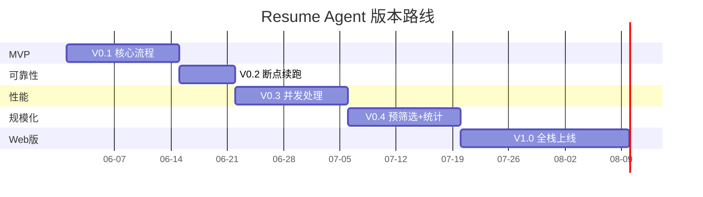
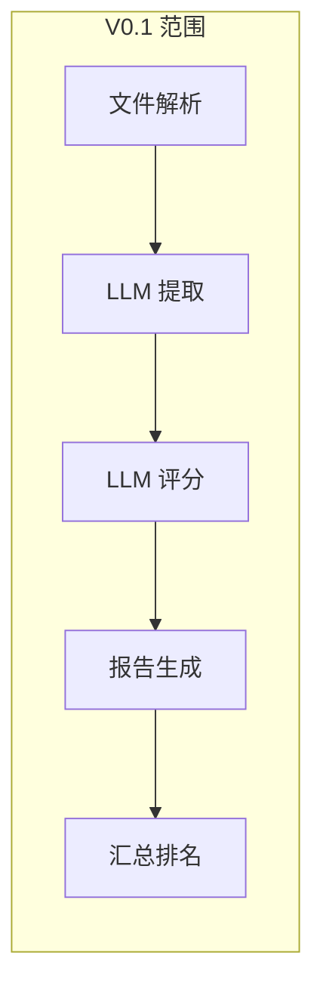
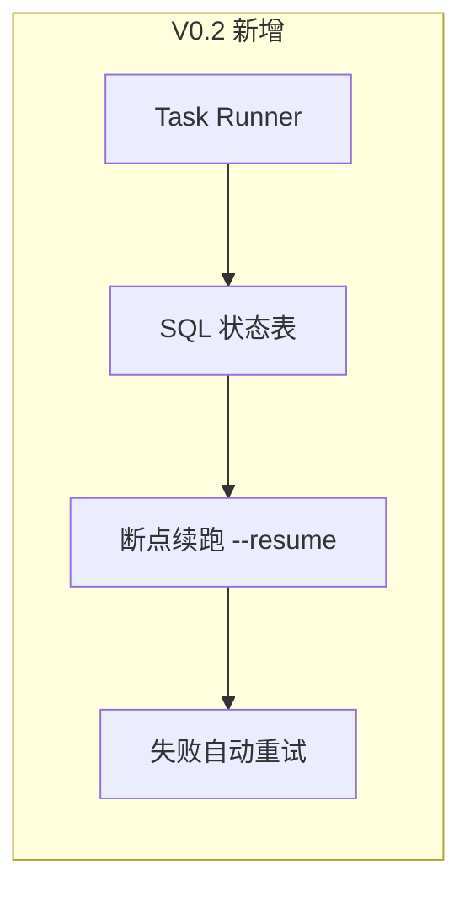
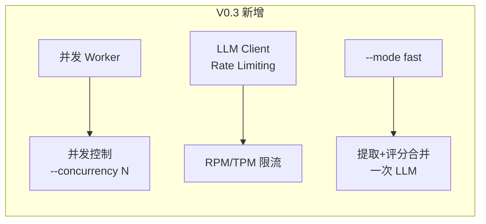
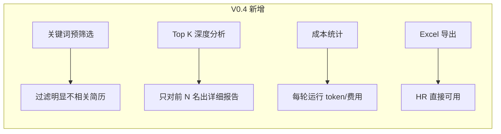
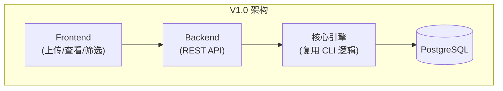

# Resume Agent Roadmap

> 最后更新: 2026-05-28 | 关联设计文档: `docs/superpowers/specs/2026-05-28-resume-agent-design.md`

---

## 版本总览

---

## V0.1 — MVP 验证

**目标**: 跑通全流程，验证 prompt 质量和评分合理性

### 交付清单

| #   | 功能                    | 说明                                     |
| --- | ----------------------- | ---------------------------------------- |
| 1   | PostgreSQL + migrations | 5 张业务表 + schema_migrations           |
| 2   | PDF/Word 解析           | 不可解析标记 skipped，不阻塞流程         |
| 3   | LLM 提取                | Claude / OpenAI 可切换，提取结果存 JSONB |
| 4   | LLM 评分                | 双维度同时打分，评分结果存 JSONB         |
| 5   | 个人 Markdown 报告      | 含基本信息 + 两维度明细 + 综合评估       |
| 6   | 汇总排名 Markdown       | 排名表，按分数降序                       |
| 7   | 汇总 JSON               | 全部数据聚合，方便程序消费               |
| 8   | CLI 工具                | run / jd / db 三组命令                   |
| 9   | 配置文件                | config.yaml，环境变量注入                |

### 不做

- 并发处理（串行逐份跑）
- 断点续跑
- Excel 导出
- Web 界面

### 验收标准

- 10 份简历 + 1 个 JD，30 分钟内完成
- 提取 JSON schema 校验通过率 > 90%
- 评分 JSON schema 校验通过率 > 90%
- 每份简历产出完整 Markdown 报告

---

## V0.2 — 可靠性

**目标**: 能处理几十份简历，不怕中断

### 交付清单

| #   | 功能             | 说明                                        |
| --- | ---------------- | ------------------------------------------- |
| 1   | Task Runner      | job_runs 表管理整体运行状态                 |
| 2   | 断点续跑         | `--resume` 跳过已完成步骤                   |
| 3   | 失败重试         | 网络错误自动重试 3 次，指数退避             |
| 4   | 简历去重         | SHA256 幂等，同文件不重复处理               |
| 5   | 每份简历独立状态 | resumes / extractions / scores 三表状态联动 |

### 验收标准

- 50 份简历中断后能成功续跑
- 同文件重复上传不触发重复 LLM 调用
- 单份网络异常不影响整体流程

---

## V0.3 — 性能

**目标**: 百份级别简历在可接受时间内完成

### 交付清单

| #   | 功能          | 说明                                     |
| --- | ------------- | ---------------------------------------- |
| 1   | 并发 Worker   | `--concurrency N` 控制 LLM 并发数        |
| 2   | Rate Limiting | LLM Client 内置 RPM/TPM 控制和排队       |
| 3   | 批处理流水线  | 阶段间流水线化，不等全部解析完就开始提取 |
| 4   | `--mode fast` | 提取+评分合并一次 LLM 调用               |

### 验收标准

- 100 份简历 + 1 个 JD，concurrency=5 时 < 15 分钟
- 不触发 API rate limit 错误
- fast 模式下单份简历处理时间 < 10 秒

---

## V0.4 — 规模化

**目标**: 几百份简历高效处理，产出 HR 友好的交付物

### 交付清单

| #   | 功能           | 说明                                          |
| --- | -------------- | --------------------------------------------- |
| 1   | 本地预筛选     | 基于 JD 关键词 + 规则粗筛                     |
| 2   | Top K 深度分析 | `--top-k-detail 50`，只对前 50 名生成完整报告 |
| 3   | 成本统计       | 每轮运行的 token 消耗 + 费用汇总              |
| 4   | Excel 导出     | `resume-agent export --format excel`          |

### 验收标准

- 500 份简历通过预筛选后送入 LLM ≤ 200 份
- Top K 模式成本比全量详细分析降低 60%+
- Excel 格式可直接用于 HR 周报

---

## V1.0 — Web 版

**目标**: HR 通过浏览器完成全流程

### 交付清单

| #   | 功能     | 说明                                           |
| --- | -------- | ---------------------------------------------- |
| 1   | 前端应用 | `repo/frontend/`，简历上传、评分查看、筛选排序 |
| 2   | REST API | `repo/backend/` 增加 API 层                    |
| 3   | 用户系统 | HR 登录，多 HR 数据隔离                        |
| 4   | 结果看板 | 可视化排名、维度对比                           |

---

## 后续版本

| 项目           | 优先级 | 说明                                   | 技术依赖                               |
| -------------- | ------ | -------------------------------------- | -------------------------------------- |
| OCR 解析       | 中     | 图片/扫描件简历                        | 需先确定输入格式和 OCR 服务            |
| 多 JD 批量评分 | 中     | 一份简历同时匹配多个岗位               | 提取复用已支持，评分阶段并发按 JD 分组 |
| 重复简历检测   | 低     | 同一候选人投了略微不同版本的简历       | 文本相似度 / embedding                 |
| 评分手册版本化 | 低     | 手册迭代后，历史评分可追溯用的哪个版本 | 评分表加 `manual_version` 字段         |
| 面试反馈闭环   | 低     | 面试结果反哺评分模型                   | 需要面试数据积累                       |
| 通知           | 低     | 评分完成后邮件/飞书通知 HR             | 邮件服务 / 飞书                        |

---

## 技术债务跟踪

| #   | 问题                                                                 | 版本 | 状态                     |
| --- | -------------------------------------------------------------------- | ---- | ------------------------ |
| 1   | LLM provider 切换目前仅支持 OpenAI / Claude，如需扩展需改 LLM Client | V0.1 | 架构预留了抽象接口       |
| 2   | Prompt 无版本管理，修改后无法回滚对比                                | V0.3 | 建议后续加 prompt 版本号 |
