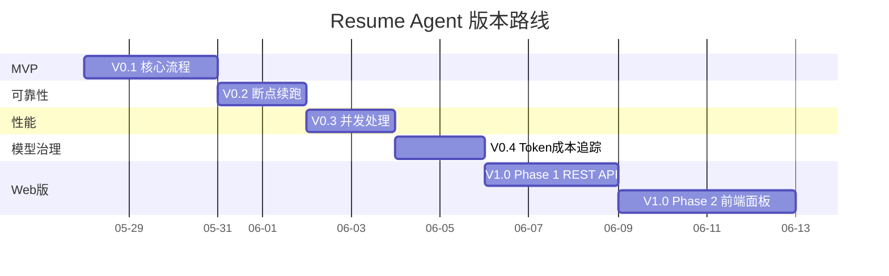
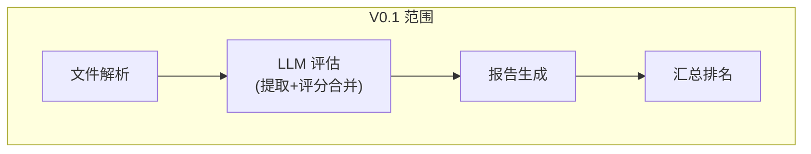
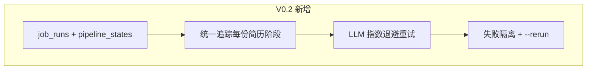
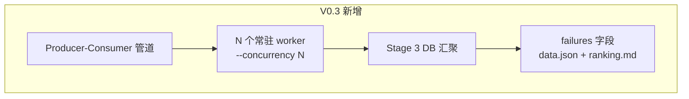
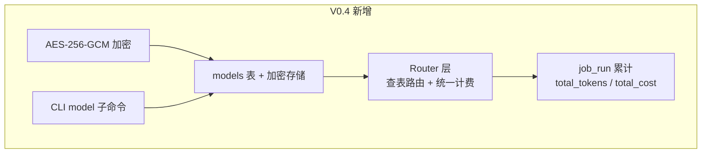
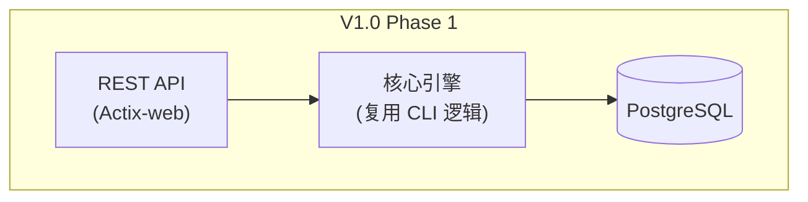

# Resume Agent Roadmap

> 最后更新: 2026-06-02
>
> - 设计: `docs/superpowers/specs/2026-05-28-resume-agent-design.md`
> - 模块: `docs/architecture/modules.md`
> - V0.3 设计: `docs/superpowers/specs/2026-05-31-v0.3-concurrency-design.md`
> - V0.4 设计: `docs/superpowers/specs/2026-06-01-v0.4-token-cost-design.md`
> - V1.0 API 设计: `docs/superpowers/specs/2026-06-02-v1.0-api-design.md`

---

## 版本总览

---

## V0.1 — MVP 验证

**目标**: 跑通全流程，验证 prompt 质量和评分合理性

### 交付清单

| #   | 功能                    | 说明                                                                             |
| --- | ----------------------- | -------------------------------------------------------------------------------- |
| 1   | PostgreSQL + migrations | 4 张业务表 (job_descriptions/resumes/evaluations/schema_migrations)              |
| 2   | PDF/Word 解析           | SHA256 去重，不可解析标记 skipped，不阻塞流程                                    |
| 3   | LLM 评估（提取+评分）   | Claude / OpenAI 可切换，一次调用完成提取+双维度评分，结果存 evaluations 表 JSONB |
| 4   | 个人 Markdown 报告      | 含基本信息 + 两维度明细 + 综合评估                                               |
| 5   | 汇总排名 Markdown       | 排名表，按人才评分降序                                                           |
| 6   | 汇总 JSON               | 全部数据聚合，方便程序消费                                                       |
| 7   | CLI 工具                | RunDir / RunFiles / JdList / JdShow / DbStatus                                   |
| 8   | 配置文件                | application.yaml，环境变量注入                                                   |
| 9   | Pipeline 幂等           | Phase 1 (file_hash) + Phase 2 (evaluation status) 跳过已完成                     |

### 不做

- 并发处理（串行逐份跑）
- 断点续跑（无显式 --resume 命令）
- LLM 失败重试
- Excel 导出
- Web 界面
- JD 关联（pipeline 不绑定 JD）

### 验收标准

- 10 份简历，30 分钟内完成
- PipelineResult JSON schema 校验通过率 > 90%
- 每份简历产出完整 Markdown 报告

---

## V0.2 — 可靠性

**目标**: 能处理几十份简历，不怕中断，状态可追踪

> **基础能力已在 V0.1 就绪**：Pipeline 已内置 SHA256 去重 + evaluation 状态检查，重新运行同一目录自动跳过已完成的文件。V0.2 补齐 LLM 韧性和统一操作记录管理。

### 交付清单

| #   | 功能              | 说明                                                                       |
| --- | ----------------- | -------------------------------------------------------------------------- |
| 1   | job_runs 操作记录 | UUID PK，每次 run 一条记录，追踪 total/parsed/evaluated/failed/errors      |
| 2   | pipeline_states   | 统一管理每份简历在每个阶段的运行状态 (parse/evaluate)                      |
| 3   | LLM 重试          | 可重试错误(429/5xx/连接超时)自动重试 3 次，指数退避 1s/2s/4s               |
| 4   | 失败隔离          | 单份简历任一阶段报错不终止整批，pipeline_states 记录 error_msg 后 continue |
| 5   | --rerun 命令      | 读取历史 job_run，从上次失败阶段精确续跑，文件缺失则报错                   |

### 不做

- 并发处理
- 文件系统监听模式

### 验收标准

- 50 份简历中任意一份网络错误不影响其余
- job_runs 表准确记录每次操作的全貌
- pipeline_states 能定位每份简历在哪个阶段失败及原因
- `--rerun` 精确续跑，已完成阶段跳过，失败阶段重试
- 运行结束打印失败清单，含文件名和错误原因

---

## V0.3 — 性能

**目标**: 百份级别简历在可接受时间内完成

> **架构设计**: `docs/superpowers/specs/2026-05-31-v0.3-concurrency-design.md`

### 交付清单

| #   | 功能              | 说明                                                                |
| --- | ----------------- | ------------------------------------------------------------------- |
| 1   | Producer-Consumer | 3-stage 管道：Stage1 解析 → bounded channel → Stage2 N worker 评估  |
| 2   | 并发控制          | `--concurrency N` (auto=3)，N 个常驻 worker，channel 容量 N×2       |
| 3   | DB 连接池检查     | 启动时 needed=concurrency×2+2 对比 max_connections，不足则 warn     |
| 4   | DB 汇聚           | Stage 3 从 DB JOIN pipeline_states 过滤本 run 结果，而非接收 Vec    |
| 5   | 失败清单          | data.json 新增 summary + failures 字段，ranking.md 新增处理失败章节 |

### 不做

- Rate Limiting（RPM/TPM）— V0.2 重试已覆盖，后续版本再考虑
- 阶段流水线化（parse 与 evaluate 重叠）— parse 远快于 evaluate，无收益

### 验收标准

- 100 份简历，concurrency=5 时 < 15 分钟
- 不触发 API rate limit 错误
- 单份简历任一阶段失败不影响其余
- data.json 和 ranking.md 包含失败清单

---

## V0.4 — 模型治理与成本追踪

**目标**: 数据库驱动的模型管理，完整 Token/费用追踪，支持多中转灵活切换

> **架构设计**: `docs/superpowers/specs/2026-06-01-v0.4-token-cost-design.md`

### 交付清单

| #   | 功能             | 说明                                                                                                       |
| --- | ---------------- | ---------------------------------------------------------------------------------------------------------- |
| 1   | models 表        | DB 注册模型（name/protocol/input_price/output_price/encrypted_key/base_url/enabled），种子内置常见模型     |
| 2   | AES-256-GCM 加密 | `utils/crypto.rs`，api_key 加密落库，MASTER_KEY 来自 yaml 配置                                             |
| 3   | Router 层        | 查 models 表路由到 openai/claude handler，统一计费，协议扩展点预留                                         |
| 4   | job_run 成本字段 | `total_tokens` + `total_cost`，每次 LLM 调用原子累加                                                       |
| 5   | CLI model 命令   | add / list / set-price / enable / disable / remove                                                         |
| 6   | run --model      | 指定本次运行使用的模型，不传默认用第一个 enabled                                                           |
| 7   | 配置重构         | `application.default.yaml` 模板（提交）+ `application.yaml` 真实配置（gitignore），移除旧的 llm 硬编码字段 |

### 不做

- 预筛选、TopK、Excel 导出 — 推迟到 V1.0 前端实现
- 自动从官网拉取定价 — 三方中转价格与官方无关

### 验收标准

- `resume-agent model add gpt-4o --protocol openai --api-key sk-xxx --input-price 2.5 --output-price 10.0` 成功加密落库
- `resume-agent run --dir ./resumes --model gpt-4o` 全程使用指定模型，费用实时计算
- job_runs 表 `total_tokens` / `total_cost` 准确反映当次运行总消耗
- 两个并发 worker 同时累加 token 数不丢失（原子 UPDATE）

---

## V1.0 — Web 版

**目标**: HR 通过浏览器完成全流程，含筛选、导出等前端交互

> **设计文档**: `docs/superpowers/specs/2026-06-02-v1.0-api-design.md`

V1.0 拆为两个阶段：

### Phase 1 — REST API

将所有 CLI 命令抽象为 `/api/v1/*` 端点，Actix-web 嵌入现有 Rust 项目。

| # | 功能 | 说明 |
|---|------|------|
| 1 | JWT 认证 | Rust 侧签发 + 校验，hardcoded 用户 + role，无密码 |
| 2 | Jobs API | 上传/提交/查询/重跑，SSE 实时进度推送 |
| 3 | JDs API | 岗位描述 CRUD |
| 4 | Models API | 模型管理（只读全员，写操作 admin） |
| 5 | System API | DB 状态、重置、缓存清理（admin only） |
| 6 | 统一响应格式 | `{ code, msg, data, detail }` 信封 + 错误码体系 |
| 7 | SSE 事件规范 | 状态快照流：job_started / stage / progress / warning / error / heartbeat / complete |
| 8 | serve 子命令 | `resume-agent serve --port 8080` 启动 HTTP 服务 |

### Phase 2 — 前端面板

基于 Next.js + shadcn，参考 `docs/references/next-shadcn-admin-dashboard/` 的 AccountSwitcher 角色切换模式。

| # | 功能 | 说明 |
|---|------|------|
| 1 | 前端应用 | `repo/frontend/`，简历上传、评分查看、筛选排序 |
| 2 | 双角色面板 | Admin 面板（模型管理 + 系统设置）+ HR 面板（简历评估 + 结果查看） |
| 3 | 结果看板 | 可视化排名、维度对比 |
| 4 | 筛选过滤 | 基于 skills/years/city/scores 等多维度筛选 |
| 5 | TopK 报告 | 前端自由选择前 N 名导出 |
| 6 | Excel 导出 | 前端按筛选结果导出 Excel |
| 7 | 管理设置页 | Admin 专属：模型管理、DB 运维、缓存清理等危险操作 |

### 不做（V1.0 移除）

- 用户注册/登录（hardcoded 用户 + JWT 切换）
- 多 HR 数据隔离（单空间，全局可见）
- 模型价格历史审计

---

## 后续版本

| 项目           | 优先级 | 说明                                   | 技术依赖                               |
| -------------- | ------ | -------------------------------------- | -------------------------------------- |
| OCR 解析       | 中     | 图片/扫描件简历                        | 需先确定输入格式和 OCR 服务            |
| 多 JD 批量评分 | 中     | 一份简历同时匹配多个岗位               | 提取复用已支持，评分阶段并发按 JD 分组 |
| 重复简历检测   | 低     | 同一候选人投了略微不同版本的简历       | 文本相似度 / embedding                 |
| 评分手册版本化 | 低     | 手册迭代后，历史评分可追溯用的哪个版本 | 评分表加 `manual_version` 字段         |
| 面试反馈闭环   | 低     | 面试结果反哺评分模型                   | 需要面试数据积累                       |
| 通知           | 低     | 评分完成后邮件/飞书通知 HR             | 邮件服务 / 飞书                        |

---

## 技术债务跟踪

| #   | 问题                                                             | 版本 | 状态                           |
| --- | ---------------------------------------------------------------- | ---- | ------------------------------ |
| 1   | LLM provider 切换目前仅支持 OpenAI / Claude，如需扩展需改 Router | V0.1 | V0.4 Router 已预留 NOTE 扩展点 |
| 2   | Prompt 无版本管理，修改后无法回滚对比                            | V0.3 | 建议后续加 prompt 版本号       |
| 3   | 模型价格无历史审计，调价后历史 job_run 无法回溯当时单价          | V0.4 | 后续可加 price_snapshots 表    |
| 4   | 用户工作空间隔离                                    | V1.0 | 无 workspace 概念，模型和 job 全局可见 |
| 5   | 模型分层（官方 vs 自定义）                          | V1.0 | sync-prices 行为与角色权限交叉，需先设计分层模型 |
| 6   | 用户数据持久化                                      | V1.0 | hardcoded 用户表，无注册/删除/修改流程 |
| 7   | Token 撤销机制                                      | V1.0 | 无黑名单、无 refresh token |
| 8   | Rate Limiting                                       | V1.0 | V0.2 重试覆盖基本韧性，API 层限流后续加 |
