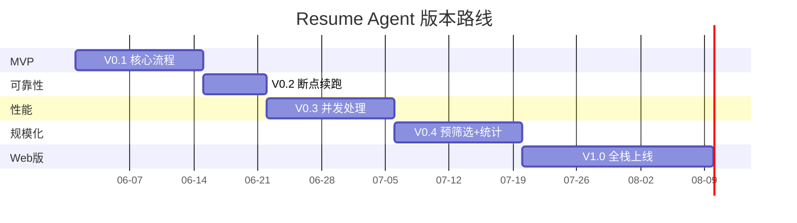
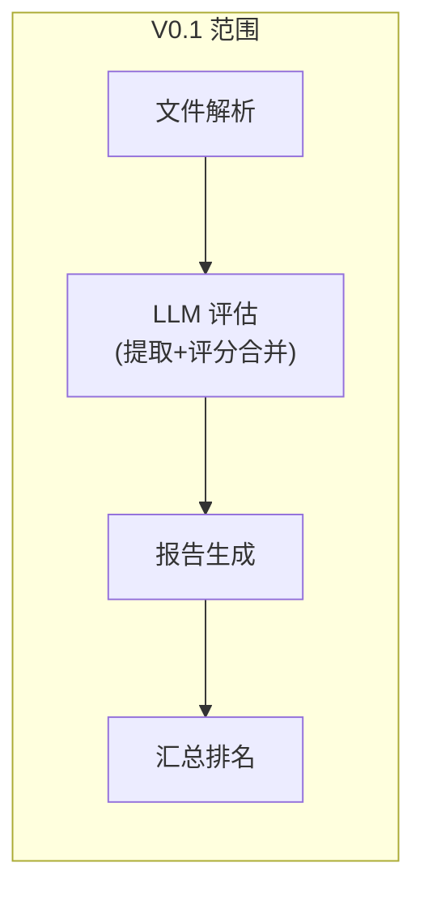
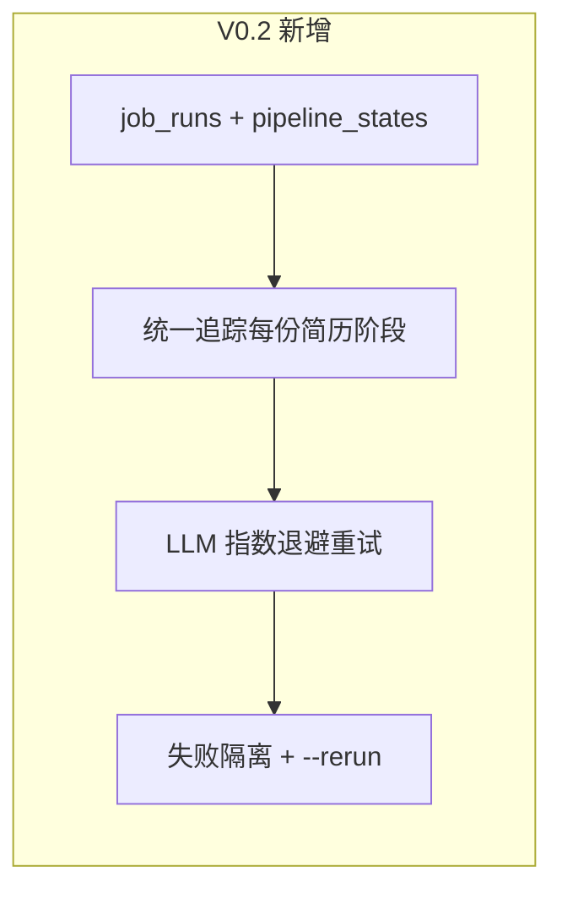
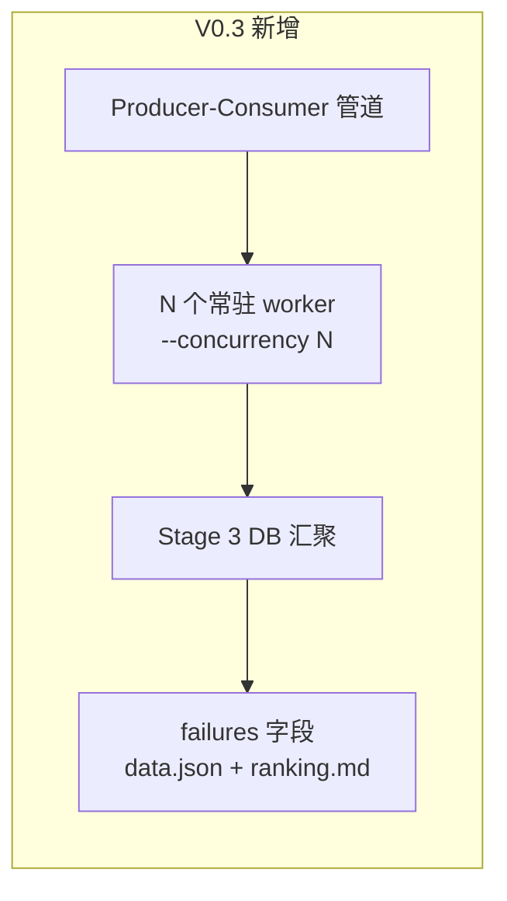
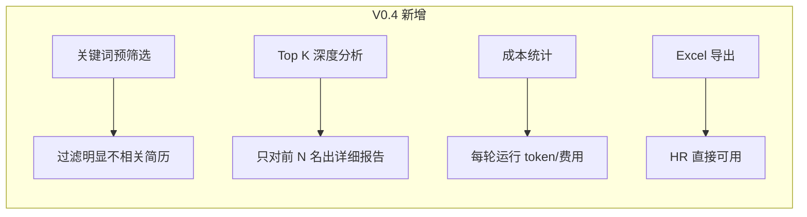
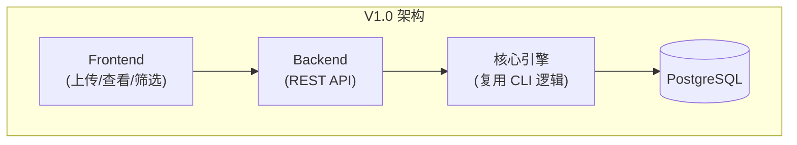

# Resume Agent Roadmap

> 最后更新: 2026-05-31 | 设计: `docs/superpowers/specs/2026-05-28-resume-agent-design.md` | 模块: `docs/architecture/modules.md` | V0.3 设计: `docs/superpowers/specs/2026-05-31-v0.3-concurrency-design.md`

---

## 版本总览

---

## V0.1 — MVP 验证

**目标**: 跑通全流程，验证 prompt 质量和评分合理性

### 交付清单

| #   | 功能                    | 说明                                                                             |
| --- | ----------------------- | -------------------------------------------------------------------------------- |
| 1   | PostgreSQL + migrations | 4 张业务表 (job_descriptions/resumes/evaluations/schema_migrations)              |
| 2   | PDF/Word 解析           | SHA256 去重，不可解析标记 skipped，不阻塞流程                                    |
| 3   | LLM 评估（提取+评分）   | Claude / OpenAI 可切换，一次调用完成提取+双维度评分，结果存 evaluations 表 JSONB |
| 4   | 个人 Markdown 报告      | 含基本信息 + 两维度明细 + 综合评估                                               |
| 5   | 汇总排名 Markdown       | 排名表，按人才评分降序                                                           |
| 6   | 汇总 JSON               | 全部数据聚合，方便程序消费                                                       |
| 7   | CLI 工具                | RunDir / RunFiles / JdList / JdShow / DbStatus                                   |
| 8   | 配置文件                | application.yaml，环境变量注入                                                   |
| 9   | Pipeline 幂等           | Phase 1 (file_hash) + Phase 2 (evaluation status) 跳过已完成                     |

### 不做

- 并发处理（串行逐份跑）
- 断点续跑（无显式 --resume 命令）
- LLM 失败重试
- Excel 导出
- Web 界面
- JD 关联（pipeline 不绑定 JD）

### 验收标准

- 10 份简历，30 分钟内完成
- PipelineResult JSON schema 校验通过率 > 90%
- 每份简历产出完整 Markdown 报告

---

## V0.2 — 可靠性

**目标**: 能处理几十份简历，不怕中断，状态可追踪

> **基础能力已在 V0.1 就绪**：Pipeline 已内置 SHA256 去重 + evaluation 状态检查，重新运行同一目录自动跳过已完成的文件。V0.2 补齐 LLM 韧性和统一操作记录管理。

### 交付清单

| #   | 功能              | 说明                                                              |
| --- | ----------------- | ----------------------------------------------------------------- |
| 1   | job_runs 操作记录 | UUID PK，每次 run 一条记录，追踪 total/parsed/evaluated/failed/errors |
| 2   | pipeline_states   | 统一管理每份简历在每个阶段的运行状态 (parse/evaluate)             |
| 3   | LLM 重试          | 可重试错误(429/5xx/连接超时)自动重试 3 次，指数退避 1s/2s/4s     |
| 4   | 失败隔离          | 单份简历任一阶段报错不终止整批，pipeline_states 记录 error_msg 后 continue |
| 5   | --rerun 命令      | 读取历史 job_run，从上次失败阶段精确续跑，文件缺失则报错          |

### 不做

- 并发处理
- 文件系统监听模式

### 验收标准

- 50 份简历中任意一份网络错误不影响其余
- job_runs 表准确记录每次操作的全貌
- pipeline_states 能定位每份简历在哪个阶段失败及原因
- `--rerun` 精确续跑，已完成阶段跳过，失败阶段重试
- 运行结束打印失败清单，含文件名和错误原因

---

## V0.3 — 性能

**目标**: 百份级别简历在可接受时间内完成

> **架构设计**: `docs/superpowers/specs/2026-05-31-v0.3-concurrency-design.md`

### 交付清单

| #   | 功能              | 说明                                                              |
| --- | ----------------- | ----------------------------------------------------------------- |
| 1   | Producer-Consumer | 3-stage 管道：Stage1 解析 → bounded channel → Stage2 N worker 评估 |
| 2   | 并发控制          | `--concurrency N` (auto=3)，N 个常驻 worker，channel 容量 N×2     |
| 3   | DB 连接池检查     | 启动时 needed=concurrency×2+2 对比 max_connections，不足则 warn   |
| 4   | DB 汇聚           | Stage 3 从 DB JOIN pipeline_states 过滤本 run 结果，而非接收 Vec  |
| 5   | 失败清单          | data.json 新增 summary + failures 字段，ranking.md 新增处理失败章节 |

### 不做

- Rate Limiting（RPM/TPM）— V0.2 重试已覆盖，后续版本再考虑
- 阶段流水线化（parse 与 evaluate 重叠）— parse 远快于 evaluate，无收益

### 验收标准

- 100 份简历，concurrency=5 时 < 15 分钟
- 不触发 API rate limit 错误
- 单份简历任一阶段失败不影响其余
- data.json 和 ranking.md 包含失败清单

---

## V0.4 — 规模化

**目标**: 几百份简历高效处理，产出 HR 友好的交付物

### 交付清单

| #   | 功能           | 说明                                          |
| --- | -------------- | --------------------------------------------- |
| 1   | 本地预筛选     | 基于 JD 关键词 + 规则粗筛                     |
| 2   | Top K 深度分析 | `--top-k-detail 50`，只对前 50 名生成完整报告 |
| 3   | 成本统计       | 每轮运行的 token 消耗 + 费用汇总              |
| 4   | Excel 导出     | `resume-agent export --format excel`          |

### 验收标准

- 500 份简历通过预筛选后送入 LLM ≤ 200 份
- Top K 模式成本比全量详细分析降低 60%+
- Excel 格式可直接用于 HR 周报

---

## V1.0 — Web 版

**目标**: HR 通过浏览器完成全流程

### 交付清单

| #   | 功能     | 说明                                           |
| --- | -------- | ---------------------------------------------- |
| 1   | 前端应用 | `repo/frontend/`，简历上传、评分查看、筛选排序 |
| 2   | REST API | `repo/backend/` 增加 API 层                    |
| 3   | 用户系统 | HR 登录，多 HR 数据隔离                        |
| 4   | 结果看板 | 可视化排名、维度对比                           |

---

## 后续版本

| 项目           | 优先级 | 说明                                   | 技术依赖                               |
| -------------- | ------ | -------------------------------------- | -------------------------------------- |
| OCR 解析       | 中     | 图片/扫描件简历                        | 需先确定输入格式和 OCR 服务            |
| 多 JD 批量评分 | 中     | 一份简历同时匹配多个岗位               | 提取复用已支持，评分阶段并发按 JD 分组 |
| 重复简历检测   | 低     | 同一候选人投了略微不同版本的简历       | 文本相似度 / embedding                 |
| 评分手册版本化 | 低     | 手册迭代后，历史评分可追溯用的哪个版本 | 评分表加 `manual_version` 字段         |
| 面试反馈闭环   | 低     | 面试结果反哺评分模型                   | 需要面试数据积累                       |
| 通知           | 低     | 评分完成后邮件/飞书通知 HR             | 邮件服务 / 飞书                        |

---

## 技术债务跟踪

| #   | 问题                                                                 | 版本 | 状态                     |
| --- | -------------------------------------------------------------------- | ---- | ------------------------ |
| 1   | LLM provider 切换目前仅支持 OpenAI / Claude，如需扩展需改 LLM Client | V0.1 | 架构预留了抽象接口       |
| 2   | Prompt 无版本管理，修改后无法回滚对比                                | V0.3 | 建议后续加 prompt 版本号 |
