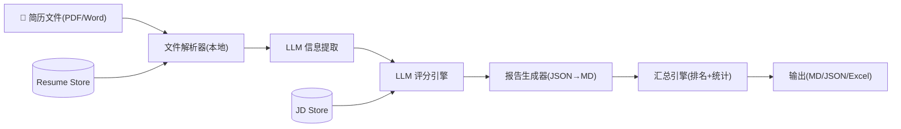
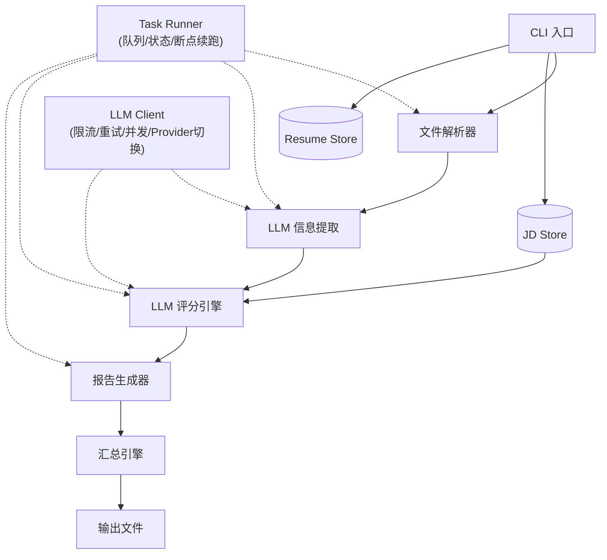
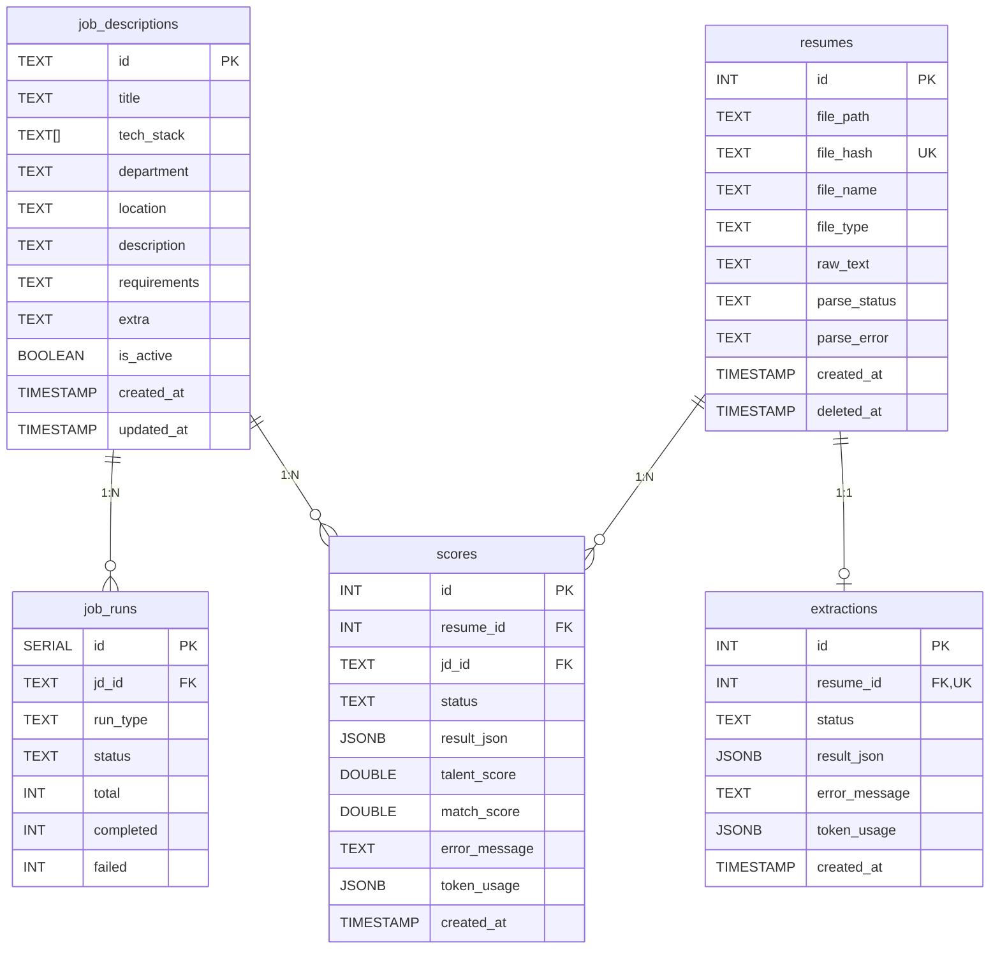
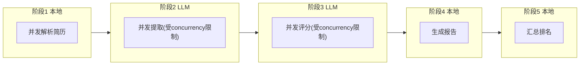
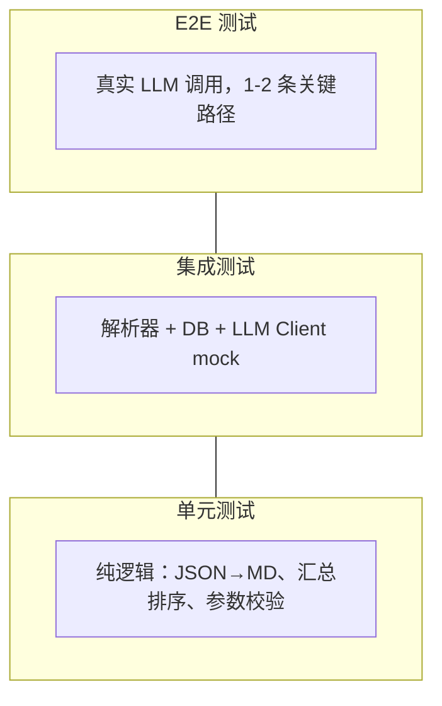

# Resume Agent 设计文档

> 版本: V1.0 | 日期: 2026-05-28 | 状态: 设计阶段

## 一、项目概述

### 1.1 一句话需求

通过 AI Agent 分析简历，提取关键信息，基于人才评级维度和岗位 JD 对候选人进行双维度评分，输出排名和详细报告。

### 1.2 核心用户

HR（招聘专员），批量筛选简历场景。

### 1.3 核心流程



---

## 二、评分体系

系统同时产出两个维度的评分：

| 维度       | 手册                  | 一级维度数 | 总分 |
| ---------- | --------------------- | ---------- | ---- |
| 人才评级   | 人才评级打分手册-V1   | 8 个       | 100  |
| 岗位匹配度 | 岗位匹配度评分手册-V1 | 7 个       | 100  |

- 每个维度下含若干二级维度，按 0-10 分评分
- 每个评分附带证据等级（强/中/弱/缺失）
- 两份手册完整保存在 `docs/references/`

---

## 三、系统架构

### 3.1 架构模式

**混合架构**：确定性步骤本地执行，需要判断推理的步骤 LLM 执行。



### 3.2 模块职责

| #   | 模块         | 运行位置         | 职责                                                            |
| --- | ------------ | ---------------- | --------------------------------------------------------------- |
| 1   | 文件解析器   | 本地             | PDF/Word → 纯文本；不可解析的标记原因并跳过                     |
| 2   | Resume Store | 本地(PostgreSQL) | 简历 hash(SHA256)、原始文本、解析状态持久化                     |
| 3   | JD Store     | 本地(PostgreSQL) | JD 增删改查，MVP 预置种子数据                                   |
| 4   | LLM Client   | 本地             | Provider 抽象(Claude/OpenAI)、限流、并发控制、重试、成本日志    |
| 5   | 信息提取器   | LLM              | 简历文本 → 结构化 JSON（基本信息 + 各维度证据片段，与 JD 无关） |
| 6   | 评分引擎     | LLM              | 提取结果 + JD + 评分手册 → 双维度评分 JSON                      |
| 7   | 报告生成器   | 本地             | 单份评分 JSON → Markdown 可读报告                               |
| 8   | 汇总引擎     | 本地             | 全部结果 → 排名表 Markdown + 汇总 JSON + Excel                  |
| 9   | Task Runner  | 本地             | 批处理流水线编排、幂等、断点续跑、并发调度                      |
| 10  | CLI 入口     | 本地             | 命令路由、参数校验、流程编排                                    |

### 3.3 技术栈

| 层           | 选型                          |
| ------------ | ----------------------------- |
| 语言         | Rust                          |
| 数据库       | PostgreSQL + SeaORM           |
| LLM Provider | OpenAI / Claude，通过配置切换 |
| 文档解析     | pdf-extract / zip (docx)      |

---

## 四、数据模型

### 4.1 实体关系图



### 4.2 PostgreSQL 表结构

```sql
-- JD 库
CREATE TABLE job_descriptions (
  id          TEXT PRIMARY KEY,
  title       TEXT NOT NULL,
  tech_stack  TEXT[],
  department  TEXT,
  location    TEXT,
  description TEXT NOT NULL,
  requirements TEXT NOT NULL,
  extra       TEXT,
  is_active   BOOLEAN DEFAULT true,
  created_at  TIMESTAMP DEFAULT now(),
  updated_at  TIMESTAMP DEFAULT now()
);

-- 简历注册表（含软删除）
CREATE TABLE resumes (
  id            SERIAL PRIMARY KEY,
  file_path     TEXT NOT NULL,
  file_hash     TEXT NOT NULL UNIQUE,  -- SHA256, 幂等关键
  file_name     TEXT NOT NULL,
  file_type     TEXT NOT NULL,         -- 'pdf' | 'docx'
  raw_text      TEXT,
  parse_status  TEXT DEFAULT 'pending', -- pending|success|failed|skipped
  parse_error   TEXT,
  created_at    TIMESTAMP DEFAULT now(),
  deleted_at    TIMESTAMP              -- 软删除标记
);

-- 提取结果（与 JD 无关，每份简历只做一次）
CREATE TABLE extractions (
  id            SERIAL PRIMARY KEY,
  resume_id     INT REFERENCES resumes(id) UNIQUE,
  status        TEXT DEFAULT 'pending', -- pending|running|success|failed
  result_json   JSONB,
  error_message TEXT,
  token_usage   JSONB,                 -- {prompt_tokens, completion_tokens, cost}
  created_at    TIMESTAMP DEFAULT now()
);

-- 评分结果（一份简历 × 一个 JD = 一条记录）
CREATE TABLE scores (
  id            SERIAL PRIMARY KEY,
  resume_id     INT REFERENCES resumes(id),
  jd_id         TEXT REFERENCES job_descriptions(id),
  status        TEXT DEFAULT 'pending',
  result_json   JSONB,
  talent_score  DOUBLE PRECISION,
  match_score   DOUBLE PRECISION,
  error_message TEXT,
  token_usage   JSONB,
  created_at    TIMESTAMP DEFAULT now(),
  UNIQUE(resume_id, jd_id)
);

-- 任务运行记录
CREATE TABLE job_runs (
  id            SERIAL PRIMARY KEY,
  jd_id         TEXT REFERENCES job_descriptions(id),
  run_type      TEXT NOT NULL,          -- 'extract' | 'score' | 'full'
  status        TEXT DEFAULT 'running',
  total         INT DEFAULT 0,
  completed     INT DEFAULT 0,
  failed        INT DEFAULT 0,
  started_at    TIMESTAMP DEFAULT now(),
  finished_at   TIMESTAMP
);

-- 迁移版本记录（工具自动维护）
CREATE TABLE schema_migrations (
  version     TEXT PRIMARY KEY,
  applied_at  TIMESTAMPTZ DEFAULT now()
);
```

### 4.3 LLM 提取结果 JSON Schema

```json
{
  "candidate": {
    "name": "string",
    "email": "string | null",
    "phone": "string | null",
    "city": "string | null",
    "years_of_experience": "number | null",
    "current_title": "string | null",
    "education": [
      { "school": "string", "degree": "string", "major": "string", "year": "number | null" }
    ],
    "skills": ["string"],
    "work_experience": [
      {
        "company": "string",
        "title": "string",
        "duration": "string",
        "highlights": ["string"]
      }
    ]
  },
  "evidence": {
    "逻辑思维与认知能力":    [{ "quote": "string", "analysis": "string", "level": "强|中|弱" }],
    "专业知识与专业技能":    [{ "quote": "string", "analysis": "string", "level": "强|中|弱" }],
    "创新与AI原生能力":     [{ "quote": "string", "analysis": "string", "level": "强|中|弱" }],
    "决策与问题解决能力":    [{ "quote": "string", "analysis": "string", "level": "强|中|弱" }],
    "组织协作与低自我":      [{ "quote": "string", "analysis": "string", "level": "强|中|弱" }],
    "抗压与韧性":           [{ "quote": "string", "analysis": "string", "level": "强|中|弱" }],
    "职业规划与自驱力":      [{ "quote": "string", "analysis": "string", "level": "强|中|弱" }],
    "履历质量与可信度":      [{ "quote": "string", "analysis": "string", "level": "强|中|弱" }]
  }
}
```

### 4.4 LLM 评分结果 JSON Schema

```json
{
  "talent_rating": {
    "total_score": "number",
    "dimensions": [
      {
        "name": "逻辑思维与认知能力",
        "score": "number",
        "evidence_level": "强|中|弱|缺失",
        "comment": "string"
      }
    ]
  },
  "job_matching": {
    "total_score": "number",
    "dimensions": [
      {
        "name": "硬性条件匹配",
        "score": "number",
        "evidence_level": "强|中|弱|缺失",
        "comment": "string"
      }
    ]
  },
  "overall_assessment": "string"
}
```

### 4.5 数据库迁移

采用版本号迁移方案，migrations 目录按序号存放 SQL 文件：

```
repo/backend/src/database/migrations/
├── 001_create_job_descriptions.sql
├── 002_create_resumes.sql
├── 003_create_extractions.sql
├── 004_create_scores.sql
├── 005_create_job_runs.sql
├── 006_seed_jds.sql
├── 007_add_resume_soft_delete.sql
└── 008_set_timezone.sql
```

CLI 命令：

```bash
resume-agent db migrate        # 执行所有未执行的迁移
resume-agent db status         # 查看当前迁移状态
```

---

## 五、目录结构

```
ResumeAgent/
├── AGENT.md
├── docs/
│   ├── architecture/
│   │   ├── overview.md
│   │   ├── data-flow.md
│   │   └── modules.md
│   ├── references/
│   │   ├── 人才评级打分手册-V1.md
│   │   ├── 岗位匹配度评分手册-V1.md
│   │   └── 职业描述和招聘职位.md
│   ├── roadmap.md
│   └── superpowers/
│       └── specs/
│           └── 2026-05-28-resume-agent-design.md
│
├── repo/
│   ├── backend/
│   │   ├── src/
│   │   │   ├── cli/
│   │   │   │   └── main.ts
│   │   │   ├── parser/
│   │   │   │   ├── pdf.ts
│   │   │   │   └── docx.ts
│   │   │   ├── llm/
│   │   │   │   ├── client.ts
│   │   │   │   ├── extractor.ts
│   │   │   │   ├── scorer.ts
│   │   │   │   └── prompts/
│   │   │   │       ├── extract-system.md
│   │   │   │       ├── extract-user.md
│   │   │   │       ├── score-system.md
│   │   │   │       └── score-user.md
│   │   │   ├── db/
│   │   │   │   └── queries.ts
│   │   │   ├── report/
│   │   │   │   ├── md.ts
│   │   │   │   └── excel.ts
│   │   │   ├── runner/
│   │   │   │   ├── pipeline.ts
│   │   │   │   └── job.ts
│   │   │   └── config.ts
│   │   ├── migrations/
│   │   │   ├── 001_create_job_descriptions.sql
│   │   │   ├── 002_create_resumes.sql
│   │   │   ├── 003_create_extractions.sql
│   │   │   ├── 004_create_scores.sql
│   │   │   ├── 005_create_job_runs.sql
│   │   │   └── 006_seed_jds.sql
│   │   ├── output/                       # gitignore
│   │   ├── tests/
│   │   ├── package.json
│   │   └── tsconfig.json
│   │
│   └── frontend/                         # 后续 Web 版
│       └── .gitkeep
```

---

## 六、CLI 命令设计

```bash
# 核心流程
resume-agent run ./resumes --jd backend-go                    # 完整流水线
resume-agent run ./resumes --jd backend-go --resume           # 断点续跑
resume-agent run ./resumes --jd backend-go --concurrency 5    # 并发
resume-agent run ./resumes --jd backend-go --mode fast        # 合并提取+评分

# JD 管理
resume-agent jd list
resume-agent jd show backend-go
resume-agent jd import ./jd/backend-go.md
resume-agent jd delete backend-go

# 数据库
resume-agent db migrate
resume-agent db status

# 结果导出
resume-agent export --jd backend-go --format excel
resume-agent export --jd backend-go --format json

# 状态查看
resume-agent status --jd backend-go
```

### LLM 配置 (config.yaml)

```yaml
llm:
  provider: openai                     # openai | claude
  models:
    openai:
      model: gpt-4o
      api_key: ${OPENAI_API_KEY}
    claude:
      model: claude-sonnet-4-6
      api_key: ${ANTHROPIC_API_KEY}
  timeout_seconds: 60
  max_retries: 3
  concurrency: 5

db:
  host: ${PG_HOST}
  port: 5432
  database: resume_agent
  user: ${PG_USER}
  password: ${PG_PASSWORD}

output:
  base_dir: ./output
  keep_intermediate: true
```

---

## 七、Prompt 设计策略

### 7.1 提取 Prompt

把评分手册中的 8 个维度定义注入 system prompt，告诉 LLM "每个维度在简历里长什么样"。User message 放简历纯文本。

**关键设计**：提取与 JD 无关，每份简历只做一次，evidence 字段天然按维度归类，评分阶段直接可用。

### 7.2 评分 Prompt

两份完整评分手册 + 10 分评分标准 + 证据等级规则放入 system prompt。User message 包含提取结果 JSON + JD 完整内容。

**关键设计**：利用 Prompt Caching。Manuals 放 system prompt 天然被 cache，后续每份简历只消耗 user message 的 token。

### 7.3 Prompt 管理

Prompt 模板独立存放在 `src/prompts/` 目录下的 Markdown 文件中，使用 `{{PLACEHOLDER}}` 占位符。代码在运行时读取文件并替换占位符。

**原因**：Prompt 是系统最需要频繁调优的部分，独立文件方便 diff、review、A/B 测试，与代码解耦。

### 7.4 JSON Schema 约束

LLM Client 调用时传入结构化输出参数，返回后用 Zod/Ajv 校验 JSON Schema，不合法则重试。

---

## 八、LLM 性能策略

### 8.1 核心原则

```
总耗时 ≈ 总 LLM 调用耗时 / 并发数
```

- 提取结果与 JD 无关，每份简历只做一次
- 同一份提取结果可对多个 JD 评分，不重复提取
- 分阶段批处理，不等全部解析完就开始提取

### 8.2 批处理流水线



### 8.3 LLM Client 能力

- Provider 抽象（OpenAI / Claude 可切换）
- 并发控制（max_concurrency）
- Rate Limiting（RPM / TPM）
- 失败重试 + 指数退避
- Token 用量 + 成本日志

---

## 九、测试策略

### 测试金字塔



### 单元测试（不需要 LLM）

| 被测模块     | 测试内容                              |
| ------------ | ------------------------------------- |
| 报告生成器   | JSON → Markdown，验证格式正确         |
| 汇总引擎     | 多份评分 → 排名表，验证排序、统计准确 |
| 配置加载     | config.yaml 解析、环境变量替换        |
| CLI 参数校验 | 非法参数报错、默认值生效              |

### 集成测试（需要 PostgreSQL）

| 被测模块           | 测试内容                                 |
| ------------------ | ---------------------------------------- |
| 文件解析器         | 真实 PDF/Word 文件 → 文本产出            |
| DB 操作            | migrations 执行、CRUD 正确性             |
| LLM Client（mock） | provider 切换、重试逻辑、rate limit 触发 |
| Task Runner        | 状态流转、幂等、断点续跑                 |

### E2E 测试（需要 LLM API key）

| 场景             | 验证点                                       |
| ---------------- | -------------------------------------------- |
| 单份简历完整流程 | 提取 JSON schema 合法、评分 JSON schema 合法 |
| 5 份简历 + 1 JD  | 汇总排名合理、报告生成无误                   |
| 黄金数据集       | 3 份标准简历，人工打分作为基准，跑分对比偏差 |

### 不测试的

- LLM 输出质量（属于 prompt engineering，通过黄金数据集 + 人工 review 验证）
- 第三方 API 稳定性

---

## 十、Roadmap

详见独立 Roadmap 文档：**[docs/roadmap.md](../../roadmap.md)**

| 版本 | 目标     | 核心交付                              |
| ---- | -------- | ------------------------------------- |
| V0.1 | MVP 验证 | 串行全流程，Prompt 质量验证           |
| V0.2 | 可靠性   | 断点续跑、失败重试、去重              |
| V0.3 | 性能     | 并发 Worker、Rate Limiting、fast 模式 |
| V0.4 | 规模化   | 预筛选、Top K、成本统计、Excel 导出   |
| V1.0 | Web 版   | 前端 + REST API + 用户系统            |
| 后续 | 持续迭代 | OCR、多 JD、手册版本化、面试闭环      |

---

## 十一、待决策事项

| #   | 问题                         | 暂定方案          | 后续讨论         |
| --- | ---------------------------- | ----------------- | ---------------- |
| 1   | OCR 图片简历的输入格式未确定 | V0.1 标记 skipped | 确定格式后再设计 |
| 2   | 前端技术栈                   | 待定              | V1.0 前决定      |
