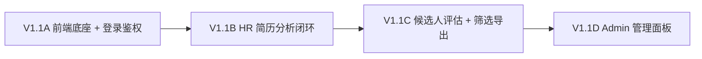
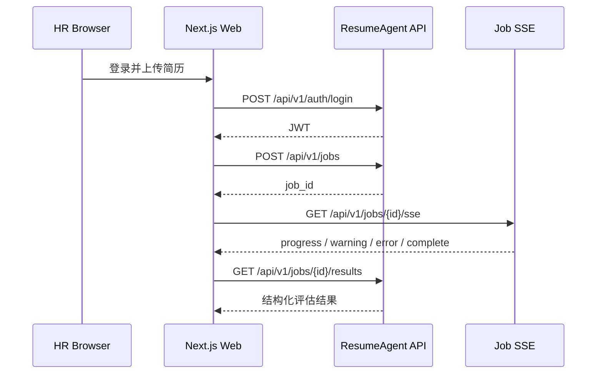

# V1.1 Web 管理面板设计

> 状态: 设计完成  
> 日期: 2026-06-03  
> 关联: `docs/roadmap.md` V1.1 章节, `docs/ui-design/page-structure.md`, `docs/ui-design/design.md`

---

## 概述

V1.0 已将 ResumeAgent 的 CLI 能力服务化为 REST API。V1.1 独立承接 Web 产品化目标，不再作为 V1.0 的 Phase 2 出现。

V1.1 的核心目标是让 HR 和 Admin 通过浏览器完成主要工作流：

```text
登录 -> 上传简历 -> 查看实时进度 -> 查看候选人评估 -> 筛选导出 -> 管理模型和系统
```

前端基于 Next.js + TypeScript + shadcn + Tailwind，参考 `docs/references/next-shadcn-admin-dashboard/` 的后台布局、侧边栏、主题和角色切换模式。

---

## 版本拆分



### V1.1A — 前端底座 + 登录鉴权

目标是建立稳定的前端工程和 API 通信基础。

交付内容：

- `repo/frontend/` 前端项目骨架。
- 裁剪参考模板，只保留 AppShell、Sidebar、Navbar、主题、基础组件和登录页所需结构。
- 统一 API Client，负责 base URL、JWT 注入、统一响应信封解析和错误提示。
- 登录页、退出登录、`GET /api/v1/auth/me` 会话恢复。
- 基于 role 的导航入口控制。

验收标准：

- 用户可登录并进入后台。
- 刷新页面后会话可恢复。
- 未登录访问业务页面会跳转登录页。
- HR 和 Admin 看到的侧边栏入口不同。

### V1.1B — HR 简历分析闭环

目标是让 HR 不再依赖 CLI，通过浏览器完成一次完整分析任务。

交付内容：

- 简历分析页：PDF / DOCX 批量上传、文件预检查、创建 Job。
- 实时进度页：消费 `GET /api/v1/jobs/{id}/sse`，展示阶段、总进度、单文件状态和失败原因。
- 分析记录页：Job 列表、状态、统计、耗时、Token 和费用摘要。
- 任务详情页：阶段时间线、失败明细、重跑入口、结果入口。
- 岗位库基础页：JD 列表、详情、新增、编辑、停用。

验收标准：

- HR 可从上传文件开始创建任务。
- SSE 断线后可通过 `GET /api/v1/jobs/{id}` 恢复权威状态。
- 任务完成后可进入本次结果。
- 失败文件不会阻塞其他文件结果展示。

### V1.1C — 候选人评估 + 筛选导出

目标是把结构化评估结果转成 HR 可决策的列表、筛选和导出界面。

交付内容：

- 候选人排名表：姓名、意向职位、AI 推荐岗位、人才评级、岗位匹配、核心技能、状态。
- 多维筛选：岗位、城市、技能、年限、人才评级分数、岗位匹配分数、评估状态。
- 候选人详情：基本信息、8 维人才评级、7 维岗位匹配、证据片段、综合评估、原始 JSON。
- TopK 选择：基于当前排序和筛选结果选择前 N 名。
- Excel 导出：导出当前筛选结果。

验收标准：

- HR 可从 Job 结果进入候选人评估页。
- 筛选条件组合后，表格、TopK 和导出结果保持一致。
- 候选人详情不依赖 Markdown 解析，直接消费结构化 JSON。
- 空结果、失败结果和部分缺失字段都有明确 UI 状态。

### V1.1D — Admin 管理面板

目标是补齐管理员对模型、用户和系统状态的基础操作。

交付内容：

- 模型管理：列表、详情、默认模型、启用/停用、价格、Key 更新。
- 用户管理：列表、创建用户、角色调整、禁用和恢复。
- 系统状态：DB 连通性、迁移状态、服务版本、缓存目录状态。
- 危险操作：重置数据库、清理缓存，必须二次确认。
- 数据中心：失败评估、解析异常、成本摘要和数据质量入口。

验收标准：

- Admin 可完成模型、用户和系统状态管理。
- HR 访问 Admin 页面时显示权限不足。
- 危险操作必须二次确认，并展示操作结果。
- 管理页错误信息来自统一响应信封，不直接暴露底层异常。

---

## 页面结构

V1.1 采用 `docs/ui-design/page-structure.md` 中的后台信息架构：

```text
核心工作
- 首页
- 简历分析
- 分析记录
- 候选人评估

基础数据
- 岗位库
- 报告中心

系统管理
- 数据中心
- 系统设置
```

V1.1A 先落地全局布局和鉴权；V1.1B 优先让“简历分析 -> 分析记录 -> 候选人评估”跑通；V1.1C 增强候选人评估；V1.1D 再补齐系统管理。

---

## API 数据流



前端状态原则：

- `GET /api/v1/jobs/{id}` 是任务权威状态来源。
- SSE 只用于实时刷新，断线后重新拉取权威状态。
- 候选人评估页以 `GET /api/v1/jobs/{id}/results` 为数据源。
- API Client 统一解析 `{ code, msg, data, detail }`，页面组件只消费成功数据或展示标准错误。

---

## 权限边界

| 区域 | HR | Admin |
|---|---|---|
| 首页 | 可见 | 可见 |
| 简历分析 | 可用 | 可用 |
| 分析记录 | 可用 | 可用 |
| 候选人评估 | 可用 | 可用 |
| 岗位库 | 可用 | 可用 |
| 报告中心 | 可用 | 可用 |
| 数据中心 | 不可见 | 可用 |
| 系统设置 | 不可见 | 可用 |
| 模型管理 | 不可见 | 可用 |
| 用户管理 | 不可见 | 可用 |

权限以 API 返回为准；前端隐藏入口只用于减少误操作，不能替代后端权限校验。

---

## 不做范围

- 不做多 HR 工作空间隔离。
- 不做在线编辑 Prompt 和评分手册。
- 不做报告模板管理。
- 不做模型价格历史审计。
- 不引入 WebSocket；实时进度继续使用 SSE。
- 不在前端解析 Markdown 报告作为核心数据源。

---

## 风险与约束

- SSE 连接不稳定时，页面必须能回退到轮询或手动刷新权威状态。
- 参考模板页面较多，必须先裁剪无关 demo，避免业务导航被模板结构牵着走。
- Excel 导出只导出当前筛选后的结构化字段，不保证与 Markdown 报告完全一致。
- Admin 危险操作必须二次确认，并在 UI 上明确展示影响范围。

