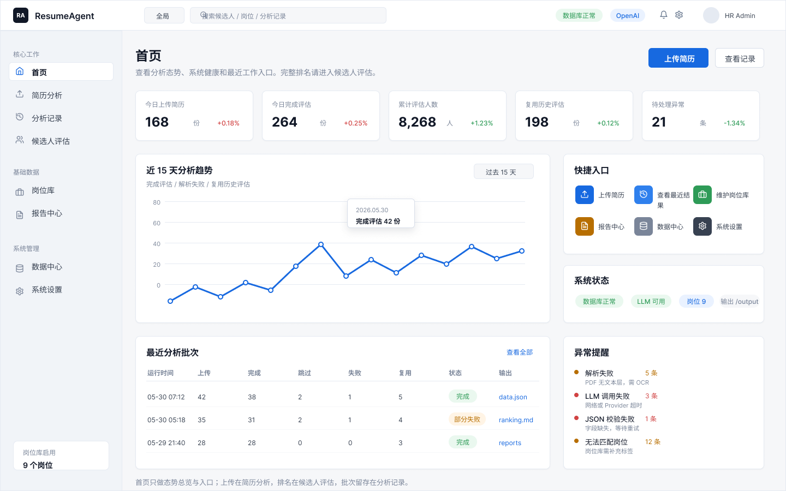

# ResumeAgent Web UI 设计系统

> 状态: V0.1 草案  
> 适用范围: ResumeAgent Web 端 B 端后台管理界面  
> 关联页面结构: `docs/ui-design/page-structure.md`

## 设计方向

ResumeAgent 的 Web UI 采用经典 B 端后台布局:

```text
Top Navbar
└── Sidebar + Children
```

产品体验重点不是营销展示，而是让 HR 快速完成:

```text
上传简历 -> 自动岗位匹配 -> AI 评估 -> 报告生成 -> 汇总留存
```

设计关键词:

- **克制**: 使用浅灰背景、白色面板、细边框和低强度阴影。
- **高效**: 首页看态势，简历分析做任务，候选人评估看结果。
- **可信**: 分数、证据、JSON、报告路径都要可追溯。
- **清晰**: JD 不作为分析前必选项，只作为自动岗位匹配的基础数据。

## 页面信息架构

```text
核心工作
- 首页
- 简历分析
- 分析记录
- 候选人评估

基础数据
- 岗位库
- 报告中心

系统管理
- 数据中心
- 系统设置
```

## Design Tokens

### Color Primitives

| Token | Value | 用途 |
| --- | --- | --- |
| `primitive/white` | `#FFFFFF` | 白色面板 |
| `primitive/gray/50` | `#F6F7F9` | 页面背景 |
| `primitive/gray/100` | `#F1F4F8` | Sidebar 背景 |
| `primitive/gray/200` | `#E5EAF2` | 分割线 / 弱边框 |
| `primitive/gray/300` | `#D8DEE9` | 默认边框 |
| `primitive/gray/500` | `#7A8599` | 次要文字 |
| `primitive/gray/700` | `#374151` | 正文 |
| `primitive/gray/900` | `#111827` | 标题 |
| `primitive/blue/50` | `#EAF2FF` | 选中背景 |
| `primitive/blue/500` | `#2F80ED` | 主品牌色 |
| `primitive/blue/600` | `#1769E0` | 主按钮 |
| `primitive/green/50` | `#EAF8EF` | 成功背景 |
| `primitive/green/600` | `#2E9B57` | 成功文字 |
| `primitive/red/50` | `#FDECEC` | 错误背景 |
| `primitive/red/600` | `#D14343` | 错误文字 |
| `primitive/orange/50` | `#FFF4E5` | 警告背景 |
| `primitive/orange/600` | `#B76E00` | 警告文字 |

### Semantic Colors

| Token | Value | 用途 |
| --- | --- | --- |
| `color/bg/app` | `primitive/gray/50` | 应用背景 |
| `color/bg/sidebar` | `primitive/gray/100` | 侧边栏背景 |
| `color/bg/surface` | `primitive/white` | 卡片 / 面板 |
| `color/bg/surface-muted` | `primitive/gray/50` | 表格头 / 弱区域 |
| `color/bg/active` | `primitive/blue/50` | 导航选中 |
| `color/bg/primary` | `primitive/blue/600` | 主按钮背景 |
| `color/text/title` | `primitive/gray/900` | 页面标题 |
| `color/text/body` | `primitive/gray/700` | 正文 |
| `color/text/secondary` | `primitive/gray/500` | 辅助文字 |
| `color/text/primary` | `primitive/blue/600` | 链接 / 强调 |
| `color/border/default` | `primitive/gray/200` | 默认边框 |
| `color/border/strong` | `primitive/gray/300` | 强边框 |
| `color/status/success/bg` | `primitive/green/50` | 成功 Tag 背景 |
| `color/status/success/text` | `primitive/green/600` | 成功 Tag 文字 |
| `color/status/error/bg` | `primitive/red/50` | 失败 Tag 背景 |
| `color/status/error/text` | `primitive/red/600` | 失败 Tag 文字 |
| `color/status/warning/bg` | `primitive/orange/50` | 跳过 / 警告 Tag 背景 |
| `color/status/warning/text` | `primitive/orange/600` | 跳过 / 警告 Tag 文字 |

### Spacing

| Token | Value | 用途 |
| --- | --- | --- |
| `spacing/2xs` | `4` | 紧凑图标间距 |
| `spacing/xs` | `8` | Tag 内边距 / 紧凑列表 |
| `spacing/sm` | `12` | 表单控件间距 |
| `spacing/md` | `16` | 卡片内边距 |
| `spacing/lg` | `20` | 面板间距 |
| `spacing/xl` | `24` | 页面区块间距 |
| `spacing/2xl` | `32` | 大区块间距 |

### Radius

| Token | Value | 用途 |
| --- | --- | --- |
| `radius/none` | `0` | 表格分割 |
| `radius/sm` | `4` | Tag / 小按钮 |
| `radius/md` | `6` | 输入框 / 导航选中 |
| `radius/lg` | `8` | 卡片 / 面板最大圆角 |
| `radius/full` | `999` | 头像 / pill |

> 页面卡片圆角不超过 8px，保持 B 端系统的克制感。

### Shadow

| Style | Value | 用途 |
| --- | --- | --- |
| `shadow/card` | `0 1px 2px rgba(15, 23, 42, 0.04)` | 普通卡片 |
| `shadow/popover` | `0 8px 24px rgba(15, 23, 42, 0.12)` | 浮层 / 抽屉 |

### Icon

图标统一使用 `lucide` 线性图标体系。

使用规则:

- 默认尺寸: 16px。
- 快捷入口按钮内图标: 16px，白色描边。
- 空状态、上传区或较大操作入口: 20px 或 24px。
- 描边宽度: 2px。
- 端点和转角: round。
- 默认颜色: `color/text/secondary`。
- 激活导航颜色: `color/text/primary`。
- 图标只表达动作或对象，不单独承载复杂业务含义。

当前映射:

| 场景 | lucide 图标 |
| --- | --- |
| 首页 | `Home` |
| 简历分析 / 上传简历 | `Upload` |
| 分析记录 / 最近结果 | `History` |
| 候选人评估 | `Users` |
| 岗位库 | `BriefcaseBusiness` / `Briefcase` |
| 报告中心 | `FileText` |
| 数据中心 | `Database` |
| 系统设置 | `Settings` |
| 搜索 | `Search` |
| 通知 | `Bell` |

### Typography

字体优先级:

```css
font-family: Inter, "Microsoft YaHei", "PingFang SC", Arial, sans-serif;
```

| Style | Size / Line Height / Weight | 用途 |
| --- | --- | --- |
| `text/page-title` | `24 / 32 / 600` | 页面标题 |
| `text/section-title` | `16 / 24 / 600` | 卡片标题 |
| `text/body` | `14 / 22 / 400` | 正文和表格 |
| `text/body-strong` | `14 / 22 / 600` | 表格重点字段 |
| `text/caption` | `12 / 18 / 400` | 辅助信息 |
| `text/metric` | `24 / 30 / 700` | 首页指标数字 |
| `text/code` | `13 / 20 / 400` | JSON / 路径 |

## Components

### AppShell

全局应用壳:

- `Navbar`: 高 56px。
- `Sidebar`: 宽 224px。
- `Children`: 占用剩余空间，背景为 `color/bg/app`。

### Navbar

内容:

- Logo + `ResumeAgent`
- 全局搜索: `搜索候选人 / 岗位 / 分析记录`
- 数据库状态
- LLM Provider
- 通知 / 设置 / 用户

### Sidebar

分组:

- 核心工作
- 基础数据
- 系统管理

状态:

- Default
- Active
- Disabled
- With badge

### Card

用于指标、图表、表格容器。

规格:

- 背景: `color/bg/surface`
- 边框: `color/border/default`
- 圆角: `radius/lg`
- 阴影: `shadow/card`
- 内边距: `spacing/md`

### Button

类型:

- Primary: 主流程动作，如 `开始分析`
- Secondary: 次级动作，如 `查看岗位库`
- Ghost: 表格行内操作，如 `查看`
- Danger: 删除 / 停用

尺寸:

- Small: 28px 高
- Medium: 32px 高
- Large: 40px 高

### Input / Search

用于全局搜索、筛选条件和表单输入。

状态:

- Default
- Focus
- Disabled
- Error

### Tag / Status

状态标签:

- `完成`: success
- `分析中`: primary
- `复用`: neutral
- `跳过`: warning
- `失败`: error
- `待处理`: neutral

### UploadPanel

简历分析页核心组件。

内容:

- 上传图标
- 文案: `拖拽 PDF / DOCX 简历到这里`
- 次级说明: `支持批量上传，文件后缀大小写不敏感`
- 文件列表
- 文件状态
- 主按钮: `开始分析`

### ProgressSteps

固定四阶段:

```text
文件解析 -> AI 评估 -> 报告生成 -> 汇总排名
```

状态:

- Waiting
- Running
- Success
- Error

### DataTable

用于分析记录、候选人评估、岗位库、数据中心。

基础规则:

- 表头背景使用 `color/bg/surface-muted`
- 行高 44px
- 支持状态 Tag
- 行内主操作使用 Ghost Button
- 分页放在表格底部右侧

### DetailDrawer

用于候选人详情、岗位详情和批次详情。

结构:

- Header: 标题 + 关闭按钮
- Body: 分组信息
- Footer: 操作按钮

## 页面内容规范

### 首页

首页只做汇总和入口。

模块:

- 今日上传简历
- 今日完成评估
- 累计评估人数
- 待处理异常
- 近 15 天分析趋势
- 最近分析批次
- 系统状态
- 快捷入口

不展示完整候选人排名。

### 简历分析

页面目标: 发起一次分析。

核心内容:

- 上传区
- 文件预检查
- 自动岗位匹配说明
- 开始分析按钮
- 四阶段进度
- 单文件状态列表
- 完成后的结果入口

关键文案:

```text
上传后系统将基于岗位库自动判断候选人最匹配岗位，无需手动选择 JD。
```

### 分析记录

页面目标: 查找和追溯一次分析。

核心内容:

- 批次列表
- 批次状态
- 输出文件
- 异常原因
- 后续断点续跑 / 失败重试入口

### 候选人评估

页面目标: 查看排名、筛选候选人、阅读评估详情。

核心内容:

- 排名表
- 筛选区
- 候选人详情抽屉
- 8 维人才评级
- 7 维岗位匹配
- 证据片段
- 原始 JSON 入口

### 岗位库

页面目标: 管理自动匹配的基础数据。

核心内容:

- 活跃岗位列表
- 岗位详情
- 新增 / 编辑 / 导入
- 启用 / 停用
- 最近被推荐次数

### 报告中心

页面目标: 管理交付物。

核心内容:

- 个人报告
- 汇总排名
- JSON 导出
- Excel 导出
- 报告预览

### 数据中心

页面目标: 监控数据质量和成本。

核心内容:

- 简历文件表
- 评估结果表
- `result_json`
- `token_usage`
- 异常统计
- Token / 成本趋势

### 系统设置

页面目标: 管理系统参数。

核心内容:

- LLM Provider
- 数据库连接
- 输出目录
- Prompt 模板
- 评分手册版本
- 超时 / 重试 / 并发

## Figma 落地范围

Figma 文件:

- [ResumeAgent UI Design System](https://www.figma.com/design/iDGRe7fVqOOREoDxtypmMK)

本次 Figma 先落地设计系统基础层和页面总览，不制作所有交互细节。

需要创建:

- `00 Cover`
- `01 Foundations`
- `02 Components`
- `03 Pages`

需要创建的变量集合:

- `RA Primitives`
- `RA Color`
- `RA Spacing`
- `RA Radius`

需要创建的样式:

- Text styles: page-title, section-title, body, body-strong, caption, metric, code
- Effect styles: card, popover

需要创建的组件:

- AppShell
- Navbar
- Sidebar
- Card
- Button
- Input
- Tag
- UploadPanel
- ProgressSteps
- DataTable
- DetailDrawer

需要创建的页面缩略稿:

- 首页
- 简历分析
- 分析记录
- 候选人评估
- 岗位库
- 报告中心
- 数据中心
- 系统设置

## Figma 当前落地结果

已完成:

- 4 个页面:
  - `00 Cover`
  - `01 Foundations`
  - `02 Components`
  - `03 Pages`
- 4 个变量集合，共 47 个变量:
  - `RA Primitives`
  - `RA Color`
  - `RA Spacing`
  - `RA Radius`
- 7 个文字样式:
  - `RA/Page Title`
  - `RA/Section Title`
  - `RA/Body`
  - `RA/Body Strong`
  - `RA/Caption`
  - `RA/Metric`
  - `RA/Code`
- 2 个阴影样式:
  - `RA/Card`
  - `RA/Popover`
- 34 个颜色 Paint Styles:
  - `RA/Primitive/*`
  - `RA/Semantic/*`
  - `RA/Status/*`
- 6 个本地组件样例:
  - `RA/Button`
  - `RA/Tag / Status`
  - `RA/Input / Search`
  - `RA/UploadPanel`
  - `RA/ProgressSteps`
  - `RA/DataTable`
- 12 个 lucide 风格图标组件:
  - `RA/Icon/Lucide/home`
  - `RA/Icon/Lucide/upload`
  - `RA/Icon/Lucide/history`
  - `RA/Icon/Lucide/users`
  - `RA/Icon/Lucide/briefcase`
  - `RA/Icon/Lucide/fileText`
  - `RA/Icon/Lucide/database`
  - `RA/Icon/Lucide/settings`
  - `RA/Icon/Lucide/search`
  - `RA/Icon/Lucide/bell`
  - `RA/Icon/Lucide/chart`
  - `RA/Icon/Lucide/list`
- `03 Pages` 页面中已放置 8 个页面缩略稿，用于验证侧边栏结构和页面职责。
- `03 Pages` 页面中已创建首页高保真稿 `RA / Screen - 首页`。
- 首页高保真稿已将侧边栏、快捷入口、搜索和顶部状态占位符替换为 lucide 风格图标。

首页当前稿:



后续需要继续精细化:

- 将组件样例拆成正式 variant set。
- 给 AppShell、Navbar、Sidebar、Card、DetailDrawer 建立独立组件。
- 继续基于当前 AppShell 复现 `简历分析` 和 `候选人评估` 两个核心页面。
- 为图表、表格、筛选器补充真实交互状态。
