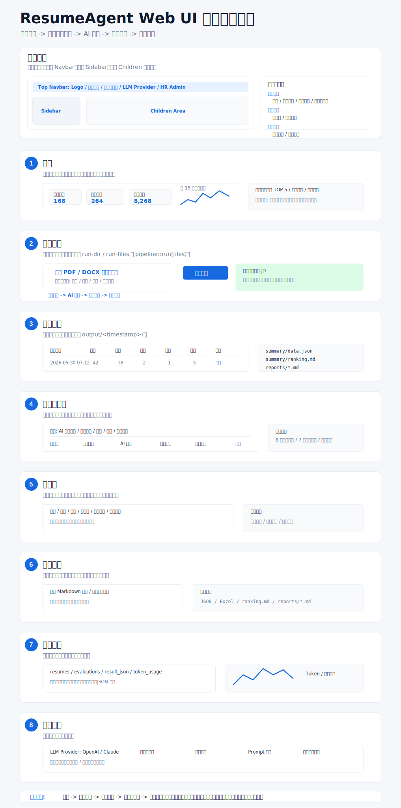

# ResumeAgent UI 页面结构说明

> 状态: 草案  
> 范围: Web 端 B 端后台布局、侧边栏信息架构、页面职责划分  
> 下一步: 基于本结构确认长图可行性后，再编写 `design.md` 设计系统文档

## 设计目标

ResumeAgent 的 Web UI 第一阶段不做营销页，也不先做复杂的人才库产品，而是围绕当前已经跑通的核心流程展开:

```text
上传简历 -> 自动岗位匹配 -> AI 评估 -> 生成报告 -> 汇总留存
```

页面结构采用经典 B 端后台布局:

```text
顶部 Navbar
└── 左侧 Sidebar + 右侧 Children 内容区
```

整体设计重点:

- 上传分析流程要清晰，用户不需要手动选择 JD。
- 岗位库是自动匹配的基础数据，不是每次分析前的阻塞项。
- 首页负责总览和入口，不承载完整排名表。
- 排名、筛选、候选人详情应独立到候选人评估页面。
- 分析批次、输出文件、JSON/Markdown 报告需要被长期留存和可追溯。

## 全局布局

### Navbar

顶部导航承担全局状态和快捷搜索:

- 产品标识: `ResumeAgent`
- 全局搜索: 候选人 / 岗位 / 分析记录
- 状态信息: 数据库连接、LLM Provider
- 用户入口: HR 管理员、通知、系统菜单

Navbar 不承载主要业务导航，主要业务导航放在 Sidebar。

### Sidebar

侧边栏按工作流分组，而不是按技术模块分组。

```text
核心工作
- 首页
- 简历分析
- 分析记录
- 候选人评估

基础数据
- 岗位库
- 报告中心

系统管理
- 数据中心
- 系统设置
```

## 页面职责

### 1. 首页

首页是运营态势总览和常用入口，不做重操作。

适合展示:

- 今日上传简历数
- 今日完成评估数
- 累计评估人数
- 失败 / 跳过 / 复用历史评估数量
- 近 7 天或 15 天分析趋势
- 最近分析批次，最多展示 5 条
- 系统状态: 数据库、LLM Provider、启用岗位数量
- 异常提醒: 解析失败、LLM 调用失败、JSON 校验失败
- 快捷入口: 上传简历、查看最近结果、维护岗位库

首页不展示完整候选人排名。若需要展示结果，只展示最近批次摘要和跳转入口。

### 2. 简历分析

简历分析页是当前版本的核心操作页，对应 `run-dir` / `run-files` 和 `pipeline::run(files)`。

核心模块:

- 上传 PDF / DOCX 简历，支持批量上传。
- 文件预检查: 文件类型、重复文件、大小、待解析状态。
- 自动岗位匹配说明: 系统基于岗位库自动判断最匹配岗位，无需手动选择 JD。
- 开始分析按钮。
- 分析阶段进度:
  - 文件解析
  - AI 评估
  - 报告生成
  - 汇总排名
- 单文件状态列表:
  - 待处理
  - 解析成功
  - 跳过
  - 复用历史评估
  - 失败
- 完成后提供结果入口:
  - 查看本次结果
  - 打开 `summary/data.json`
  - 打开 `summary/ranking.md`
  - 查看 `reports/*.md`

### 3. 分析记录

分析记录页负责批次留存和历史追溯，对应 `output/<timestamp>/`。

核心模块:

- 分析批次列表。
- 每个批次展示:
  - 运行时间
  - 上传数量
  - 完成数量
  - 跳过数量
  - 失败数量
  - 复用数量
  - 当前状态
- 批次详情:
  - 运行阶段时间线
  - 文件处理明细
  - 输出文件列表
  - 异常原因
- 输出物入口:
  - `summary/data.json`
  - `summary/ranking.md`
  - `reports/*.md`

后续 V0.2 可以在这里承载断点续跑、失败重试和继续分析。

### 4. 候选人评估

候选人评估页承载排名、筛选、候选人详情，是查看结果的主页面。

核心模块:

- 候选人排名表。
- 筛选条件:
  - AI 推荐岗位
  - 意向职位
  - 城市
  - 技能
  - 人才评级分数区间
  - 岗位匹配分数区间
  - 评估状态
- 表格字段:
  - 候选人
  - 意向职位
  - AI 推荐岗位
  - 人才评级
  - 岗位匹配
  - 核心技能
  - 报告入口
- 候选人详情:
  - 基本信息
  - 8 维人才评级
  - 7 维岗位匹配
  - 证据片段
  - 综合评估
  - 原始 `result_json`

该页面主要消费 `evaluations.result_json` 和 `summary/data.json`。

### 5. 岗位库

岗位库是自动匹配的基础数据，不是分析前必须选择的输入项。

核心模块:

- 活跃岗位列表。
- 岗位详情:
  - 标题
  - 部门
  - 地点
  - 技术栈
  - 岗位描述
  - 岗位要求
  - 额外信息
- 启用 / 停用。
- 新增、编辑、导入岗位。
- 最近被推荐次数，用于观察岗位匹配分布。

### 6. 报告中心

报告中心偏交付物管理，区别于候选人评估页的数据筛选。

核心模块:

- 个人 Markdown 报告列表。
- 汇总排名报告。
- JSON / Excel 导出入口。
- 按批次、候选人、岗位筛选报告。
- 报告预览。

后续可以扩展报告模板管理。

### 7. 数据中心

数据中心偏底层数据质量、成本和状态监控。

核心模块:

- 简历文件表:
  - 文件 hash
  - 文件名
  - 文件类型
  - 解析状态
  - 去重状态
- 评估结果表:
  - `matched_jd_id`
  - `target_role`
  - `best_match_role`
  - `talent_score`
  - `match_score`
  - `result_json`
  - `token_usage`
- 数据质量:
  - 缺失报告
  - 失败评估
  - 无法匹配岗位
  - JSON 结构异常
- 后续成本统计:
  - token 消耗
  - 估算费用
  - Provider 分布

### 8. 系统设置

系统设置承载技术配置和规则配置。

核心模块:

- LLM Provider: OpenAI / Claude。
- 数据库连接状态。
- 输出目录配置。
- Prompt 模板。
- 评分手册版本。
- 超时、重试、并发参数。
- 管理员账户和权限，后续 V1.0 扩展。

## 页面关系

```text
首页
├── 点击上传简历 -> 简历分析
├── 点击最近批次 -> 分析记录详情
├── 点击异常提醒 -> 数据中心
└── 点击岗位库状态 -> 岗位库

简历分析
├── 上传并开始分析
├── 完成后 -> 分析记录详情
└── 完成后 -> 候选人评估

分析记录
├── 查看批次输出物 -> 报告中心
└── 查看候选人结果 -> 候选人评估

候选人评估
├── 查看个人报告 -> 报告中心 / 报告详情
└── 查看原始 JSON -> 数据中心

岗位库
└── 作为自动岗位匹配的基础数据，被简历分析流程读取
```

## 当前数据映射

| UI 概念 | 当前数据来源 |
| --- | --- |
| 简历文件 | `resumes` |
| 岗位库 | `job_descriptions` |
| 候选人评估 | `evaluations` |
| AI 推荐岗位 | `evaluations.best_match_role` / `evaluations.matched_jd_id` |
| 意向职位 | `evaluations.target_role` |
| 人才评级 | `evaluations.talent_score` |
| 岗位匹配 | `evaluations.match_score` |
| 完整结果 | `evaluations.result_json` |
| Token / 成本 | `evaluations.token_usage` |
| 汇总 JSON | `output/<timestamp>/summary/data.json` |
| 汇总排名 | `output/<timestamp>/summary/ranking.md` |
| 个人报告 | `output/<timestamp>/reports/*.md` |

## 长图草案

页面总览长图将用于验证这些页面是否能形成完整产品闭环:



## 待确认问题

- 首页指标是否以“分析效率”为主，还是要加入更多 HR 招聘业务指标。
- 报告中心是否需要从候选人评估中独立出来，还是第一版合并为候选人详情中的报告 Tab。
- 数据中心第一版是否展示给普通 HR，还是只给管理员。
- 分析记录是否需要在第一版就做“批次详情”，还是先只展示列表和输出文件入口。
